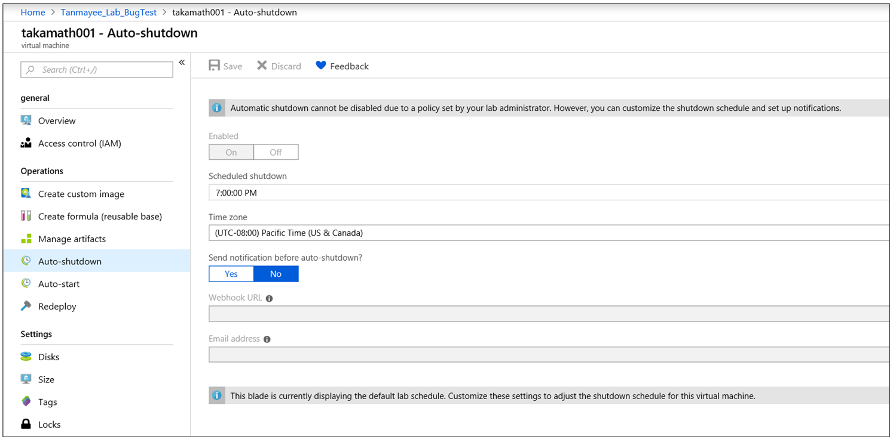

# Welcome to Activate Azure with DevTest Labs

## Conditions and Terms of Use Microsoft Confidential - For Internal Use Only

This training package is proprietary and confidential, and is intended only for uses described in the training materials. Content and software is provided to you under a Non-Disclosure Agreement and cannot be distributed. Copying or disclosing all or any portion of the content and/or software included in such packages is strictly prohibited.

The contents of this package are for informational and training purposes only and are provided "as is" without warranty of any kind, whether express or implied, including but not limited to the implied warranties of merchantability, fitness for a particular purpose, and non-infringement.

Training package content, including URLs and other Internet Web site references, is subject to change without notice. Because Microsoft must respond to changing market conditions, the content should not be interpreted to be a commitment on the part of Microsoft, and Microsoft cannot guarantee the accuracy of any information presented after the date of publication. Unless otherwise noted, the companies, organizations, products, domain names, e-mail addresses, logos, people, places, and events depicted herein are fictitious, and no association with any real company, organization, product, domain name, e-mail address, logo, person, place, or event is intended or should be inferred.

**Copyright and Trademarks**

Microsoft may have patents, patent applications, trademarks, copyrights, or other intellectual property rights covering subject matter in this document. Except as expressly provided in written license agreement from Microsoft, the furnishing of this document does not give you any license to these patents, trademarks, copyrights, or other intellectual property.

Complying with all applicable copyright laws is the responsibility of the user. Without limiting the rights under copyright, no part of this document may be reproduced, stored in or introduced into a retrieval system, or transmitted in any form or by any means (electronic, mechanical, photocopying, recording, or otherwise), or for any purpose, without the express written permission of Microsoft Corporation.

For more information, see Use of Microsoft Copyrighted Content at [(http://www.microsoft.com/about/legal/permissions/)](http://www.microsoft.com/about/legal/permissions/)

Microsoft®, Internet Explorer®, and Windows® are either registered trademarks or trademarks of Microsoft Corporation in the United States and/or other countries. Other Microsoft products mentioned herein may be either registered trademarks or trademarks of Microsoft Corporation in the United States and/or other countries. All other trademarks are property of their respective owners.

© 2019 Microsoft Corporation.  All rights reserved.

# Module 1 Lab - Create a DevTest Lab

### In this lab you will

1.  [Create a lab via the Portal](#Create-a-lab-via-the-Portal)
2.  [Specify resource group for lab virtual machines](#Specify-resource-group-for-lab-virtual-machines)
3.  [Add an internal support statement](#Add-an-internal-support-statement)
4.  [Set policies and schedules](#Set-policies-and-schedules)
5.  [Scale your lab](#Scale-your-lab)

## Exercise 1
### Create a lab via the Portal
The following steps illustrate how to use the Azure portal to create a lab in Azure DevTest Labs.

1. Sign in to the Azure portal.

2. From the main menu on the left side, select All Services (at the top of the list). Select * (star) next to DevTest Labs in the **DevOps** section. This action adds DevTest Labs to the left navigational menu so that you can access it easily the next time.

3. Now, select DevTest Labs on the left navigational menu. Select Add on the toolbar.

4. On the Create a DevTest Lab page, do the following actions:

    a. Enter a name for the lab.

    b. Select the Subscription to associate with the lab.

    c. Enter a name for the resource group for the lab.

    d. Select a location in which to store the lab.

    e. Select Auto-shutdown to specify if you want to enable - and define the parameters for - the automatic shutting down of all the lab's VMs. The auto-shutdown feature is mainly a cost-saving feature whereby you can specify when you want the VM to automatically be shut down. You can change auto-shutdown settings after creating the lab by following the steps outlined in the article Manage all policies for a lab in Azure DevTest Labs.

    f. Enter NAME and VALUE information for Tags if you want to create custom tagging that is added to every resource you will create in the lab. Tags are useful to help you manage and organize lab resources by category. Tags are helpful when you want to organize resources for usage or cost. For more information about tags, including how to add tags after creating the lab, see Add tags to a lab.

    g. Select Automation options to get Azure Resource Manager templates for configuration automation.

    h. Select Create. You can monitor the status of the lab creation process by watching the Notifications area.

    i. Once completed, select Go to resource in the notification. Alternatively, refresh the DevTest Labs page to see the newly created lab in the list of labs. Select the lab in the list. You see the home page for your lab.

## Exercise 2
### Specify resource group for lab virtual machines

As a lab owner, you can configure your lab virtual machines to be created in a specific resource group. This feature helps you in the following scenarios:

- Have fewer resource groups created by labs in your subscription.
- Have your labs operate within a fixed set of resource groups that you configure.
- Work around restrictions and approvals required for creating resource groups within your Azure subscription.
- Consolidate all your lab resources within a single resource group to simplify tracking those resources and applying policies to manage resources at the resource group level.

Follow these steps to specify a resource group for all VMs created in the lab.

1. Sign in to the Azure portal.

2. Select All Services on the left navigational menu.

3. Select DevTest Labs from the list.

4. From the list of labs, select your lab.

5. Select Configuration and policies in the Settings section on the left menu.

6. Select Lab settings on the left menu.

7. Select All virtual machines in one resource group.

8. Select an existing resource group in the drop-down list (or) select Create new, enter a name for the resource group, and select OK.

## Exercise 3
### Add an internal support statement

Azure DevTest Labs lets you customize your lab with an internal support statement that provides users with support information about the lab. For example, you can provide contact information so that a user knows how to reach internal support when they need help with troubleshooting or accessing resources in the lab. You can also provide links to internal websites or FAQs that your team can access before contacting support.

### Steps to add a support statement to an existing lab
1. Sign in to the Azure portal.

2. If necessary, select All Services, and then select DevTest Labs from the list. (Your lab might already be shown on the Dashboard under All Resources).

3. From the list of labs, select the lab in which you want to add a support statement.

4. On the lab's Overview area, select Configuration and policies.

5. On the left under SETTINGS, select Internal support.

6. To create an internal support message for the users in this lab, set Enabled to Yes.

7. In the Support message field, enter the internal support statement that you want to present to your lab users. The support message accepts Markdown. As you enter the message text, you can view the Preview area at the bottom of the screen to see how the message appears to users.

8. Select Save once your support statement is ready to post.

When you no longer want to show this support message to lab users, return to the Internal support page and set Enabled to No

## Exercise 4
### Set policies and schedules 

Azure DevTest Labs lets you control cost and minimizes waste in your labs by managing policies (settings) for each lab. This article explains in step-by-step detail how to set each policy.

### Set allowed virtual machine sizes

1. In the Azure portal, select a lab and then select Configuration and policies.

2. On the lab's Configuration and policies pane, select Allowed virtual machines sizes.

3. Select On to enable this policy, and Off to disable it.

4. If you enable this policy, select one or more VM sizes that can be created in your lab.

5. Select Save.

### Set virtual machines per user

The policy for Virtual machines per user lets you specify the number of VMs that can be created by an individual user. If a user tries to create or claim a VM when the user limit has been met, an error message indicates that the VM cannot be created/claimed.

1. On the lab's Configuration and policies pane, select Virtual machines per user.

2. Select Yes to limit the number of VMs per user. If you do not want to limit the number of VMs per user, select No. If you select Yes, enter a numeric value indicating the number of VMs that can be created or claimed by a user.

3. Select Yes to limit the number of VMs that can use SSD (solid-state disk). If you do not want to limit the number of VMs that can use SSD, select No. If you select Yes, enter a value indicating the number of VMs that can be created using SSD.

4. Select Save.

### Set virtual machines per lab
The policy for Virtual machines per lab lets you specify the number of VMs that can be created for the current lab. If a user tries to create a VM when the lab limit has been met, an error message indicates that the VM cannot be created.

1. On the lab's Configuration and policies pane, select Virtual machines per lab

2. Select Yes to limit the number of VMs per lab. If you do not want to limit the number of VMs per lab, select No. If you select Yes, enter a numeric value indicating the number of VMs that can be created or claimed by a user.

3. Select Yes to limit the number of VMs that can use SSD (solid-state disk). If you do not want to limit the number of VMs that can use SSD, select No. If you select Yes, enter a value indicating the number of VMs that can be created using SSD.

4. Select Save

### Set auto shutdown
The auto shutdown policy helps minimize lab waste by letting you specify the time that this lab's VMs shut down.

1. On the lab's Configuration and policies pane, select Auto shutdown.

2. Select On to enable this policy, and Off to disable it.

3. If you enable this policy, specify the time (and time zone) to shut down all VMs in the current lab.

4. Specify Yes or No for the option to send a notification 15 minutes before the specified auto shutdown time. If you choose Yes, enter a webhook URL endpoint or an email address specifying where you want the notification to be posted or sent. The user receives notification and is given the option to postpone the shutdown.

5. Select Save.

By default, once enabled, this policy applies to all VMs in the current lab. To remove this setting from a specific VM, open the VM's management pane and change its Auto shutdown setting.

### Set auto shutdown policy
As a lab owner, you can configure a shutdown schedule for all the VMs in your lab. By doing so, you can save costs from running machines that aren't being used (idle). You can enforce a shutdown policy on all your lab VMs centrally but also save your lab users the effort from setting up a schedule for their individual machines. This feature enables you to set the policy on your lab schedule starting from offering no control to full control, to your lab users. As a lab owner, you can configure this policy by taking the following steps:

1. On the home page for your lab, select Configuration and policies.

2. Select Auto shutdown policy in the Schedules section of the left menu.

3. Select one of the options. The following sections give you more details about these options: The set policy applies only to new VMs created in the lab and not to the already existing VMs.

#### User sets a schedule and can opt out
If you set your lab to this policy, the lab users can override or opt out of the lab schedule. This option grants lab users full control over auto shutdown schedule of their VMs. Lab users see no change in their VM auto shutdown schedule page.

#### User has no control over the schedule set by lab admin
If you set your lab to this policy, lab users can't override or opt out of the lab schedule. This option offers lab admin the complete control on the schedule for every machine in the lab. Lab users can only set up auto shutdown notifications for their VMs.

### Set autostart
The autostart policy lets you specify when the VMs in the current lab should be started.

1. On the lab's Configuration and policies pane, select Autostart.

2. Select On to enable this policy, and Off to disable it.

3. If you enable this policy, specify the scheduled start time, time zone, and the days of the week for which the time applies.

4. Select Save.

Once enabled, this policy is not automatically applied to any VMs in the current lab. To apply this setting to a specific VM, open the VM's management pane and change its Autostart setting

## Exercise 5
### Scale your lab 

As you work in DevTest Labs, you might notice that there are certain default limits to some Azure resources, which can affect the DevTest Labs service. These limits are referred to as quotas.

####  Note
The DevTest Labs service doesn't impose any quotas. Any quotas you might encounter are default constraints of the overall Azure subscription.

You can use each Azure resource until you reach its quota. Each subscription has separate quotas and usage is tracked per subscription.

For example, each subscription has a default quota of 20 cores. So, if you are creating VMs in your lab with four cores each, then you can only create five VMs.

Azure Subscription and Service Limits lists some of the most common quotas for Azure resources. The resources most commonly used in a lab, and for which you might encounter quotas, include VM cores, public IP addresses, network interface, managed disks, RBAC role assignment, and ExpressRoute circuits.

### View your usage and quotas

These steps show you how to view the current quotas in your subscription for specific Azure resources, and to see what percentage of each quota you have used.

1. Sign in to the Azure portal.

2. Select More Services, and then select Billing from the list.

3. In the Billing blade, select a subscription.

4. Select Usage + quotas.

The Usage + quotas blade appears, listing different resources available in that subscription and the percentage of the quota that is being used per resource.

### Requesting more resources in your subscription
If you reach a quota cap, the default limit of a resource in a subscription can be increased up to a maximum limit, as described in Azure Subscription and Service Limits.

These steps show you how to request a quota increase through the Azure portal.

1. Select More Services, select Billing, and then select Usage + quotas.

2. In the Usage + quotas blade, select the Request Increase button.

3. To complete and submit the request, fill out the required information on all three tabs of the New support request form

