# Welcome to DevTest Lab

## Conditions and Terms of Use Microsoft Confidential - For Internal Use Only

This training package is proprietary and confidential, and is intended only for uses described in the training materials. Content and software is provided to you under a Non-Disclosure Agreement and cannot be distributed. Copying or disclosing all or any portion of the content and/or software included in such packages is strictly prohibited.

The contents of this package are for informational and training purposes only and are provided "as is" without warranty of any kind, whether express or implied, including but not limited to the implied warranties of merchantability, fitness for a particular purpose, and non-infringement.

Training package content, including URLs and other Internet Web site references, is subject to change without notice. Because Microsoft must respond to changing market conditions, the content should not be interpreted to be a commitment on the part of Microsoft, and Microsoft cannot guarantee the accuracy of any information presented after the date of publication. Unless otherwise noted, the companies, organizations, products, domain names, e-mail addresses, logos, people, places, and events depicted herein are fictitious, and no association with any real company, organization, product, domain name, e-mail address, logo, person, place, or event is intended or should be inferred.

**Copyright and Trademarks**

Microsoft may have patents, patent applications, trademarks, copyrights, or other intellectual property rights covering subject matter in this document. Except as expressly provided in written license agreement from Microsoft, the furnishing of this document does not give you any license to these patents, trademarks, copyrights, or other intellectual property.

Complying with all applicable copyright laws is the responsibility of the user. Without limiting the rights under copyright, no part of this document may be reproduced, stored in or introduced into a retrieval system, or transmitted in any form or by any means (electronic, mechanical, photocopying, recording, or otherwise), or for any purpose, without the express written permission of Microsoft Corporation.

For more information, see Use of Microsoft Copyrighted Content at [(http://www.microsoft.com/about/legal/permissions/)](http://www.microsoft.com/about/legal/permissions/)

Microsoft®, Internet Explorer®, and Windows® are either registered trademarks or trademarks of Microsoft Corporation in the United States and/or other countries. Other Microsoft products mentioned herein may be either registered trademarks or trademarks of Microsoft Corporation in the United States and/or other countries. All other trademarks are property of their respective owners.

© 2019 Microsoft Corporation.  All rights reserved.

## Excerise 1: Steps to add a VM to a lab in Azure DevTest Labs

1.  Sign in to the [Azure portal](https://go.microsoft.com/fwlink/p/?LinkID=525040).

2.  Select **All Services**, and then select **DevTest Labs** in the **DevOps** section. If you select * (star) next to **DevTest Labs** in the **DEVOPS** section. This action adds **DevTest Labs** to the left navigational menu so that you can access it easily the next time. Then, you can select **DevTest Labs** on the left navigational menu.

    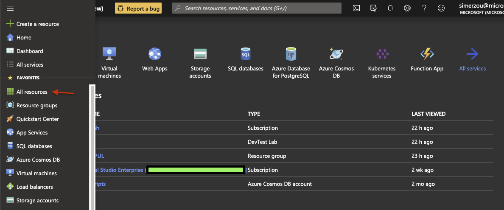
    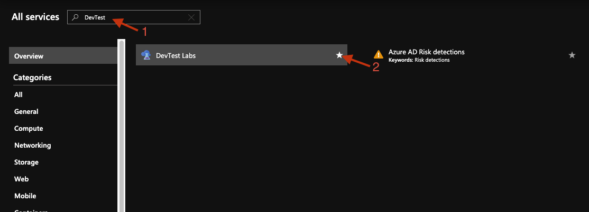

3.  From the list of labs, select the lab in which you want to create the VM.

4.  On the lab's **Overview** page, select **+ Add**.

    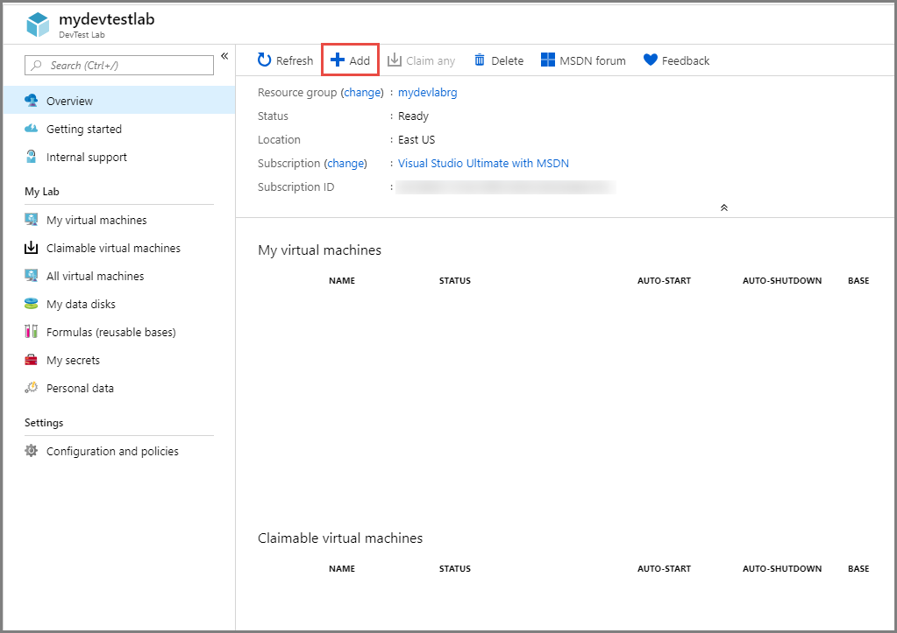

5.  On the **Choose a base** page, select a marketplace image for the VM.

6.  On the **Basic Settings** tab of the **Virtual machine** page, do the following actions:

    1.  Enter a name for the VM in the **Virtual machine name** text box. The text box is pre-filled for you with a unique auto-generated name. The name corresponds to the user name within your email address followed by a unique 3-digit number. This feature saves you the time to think of a machine name and type it every time you create a machine. You can override this auto-filled field with a name of your choice if you wish to. To override the auto-filled name for the VM, enter a name in the **Virtual machine name** text box.

    2.  Enter a **User Name** that is granted administrator privileges on the virtual machine. The **user name** for the machine is pre-filled with a unique auto-generated name. The name corresponds to the user name within your email address. This feature saves you the time to decide on a username every time you create a new machine. Again, you can override this auto-filled field with a username of your choice if you wish to. To override the auto-filled value for user name, enter a value in the **User Name** text box. This user is granted **administrator** privileges on the virtual machine.

    3.  If you are creating first VM in the lab, enter a **password** for the user. To save this password as a default password in the Azure key vault associated with the lab, select **Save as default password**. The default password is saved in the key vault with the name: **VmPassword**. When you try to create subsequent VMs in the lab, **VmPassword** is automatically selected for the **password**. To override the value, clear the **Use a saved secret** check box, and enter a password.

        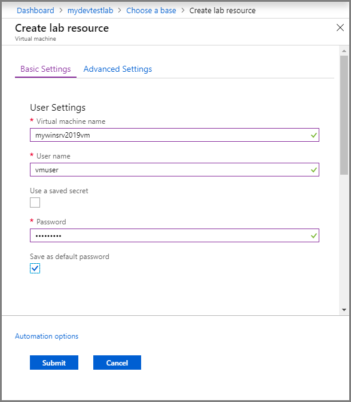

        You can also save secrets in the key vault first and then use it while creating a VM in the lab. For more information, see [Store secrets in a key vault](devtest-lab-store-secrets-in-key-vault). To use the password stored in the key vault, select **Use a saved secret**, and specify a key value that corresponds to your secret (password).

    4.  In the **More options** section, select **Change size**. Select one of the predefined items that specify the processor cores, RAM size, and the hard drive size of the VM to create.

    5.  Select **Add or Remove Artifacts**. Select and configure the artifacts that you want to add to the base image. **Note:** If you're new to DevTest Labs or configuring artifacts, refer to the [Add an existing artifact to a VM](devtest-lab-add-vm#add-an-existing-artifact-to-a-vm) section, and then return here when finished.

7.  Switch to the **Advanced Settings** tab at the top, and do the following actions:

    1.  To change the virtual network that the VM is in, select **Change VNet**.

    2.  To change the subnet, select **Change subnet**.

    3.  Specify whether the IP address of the VM is **public, private, or shared**.

    4.  To automatically delete the VM, specify the **expiration date and time**.

    5.  To make the VM claimable by a lab user, select **Yes** for **Make this machine claimable** option.

    6.  Specify the number of the **instances of VM** that you want to make it available to your lab users.

        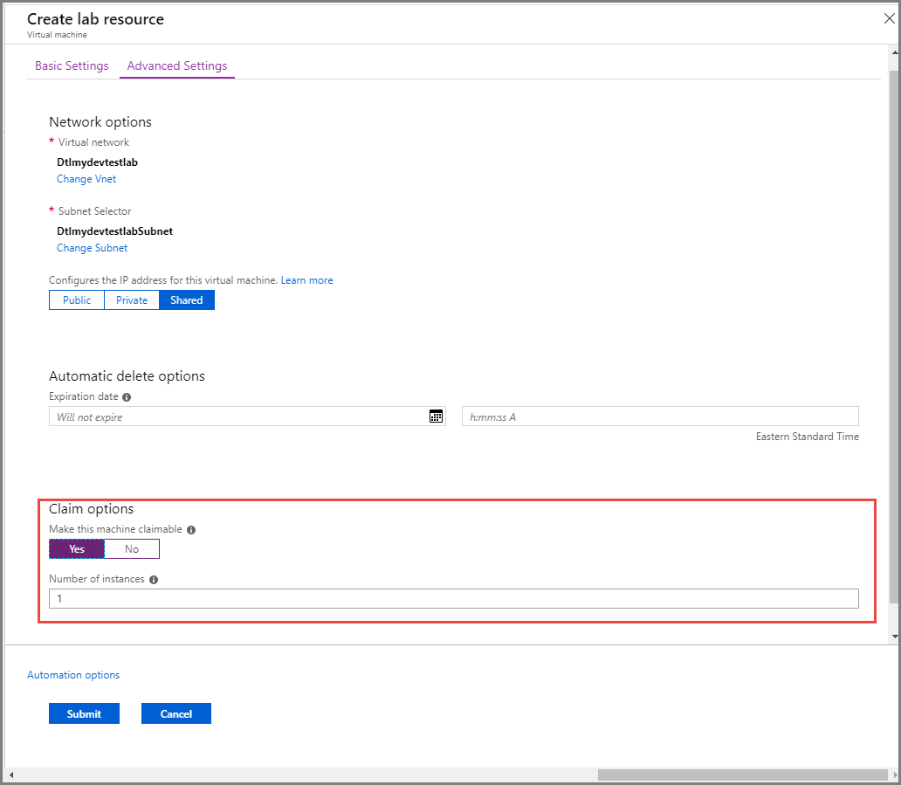

8.  Select **Create** to add the specified VM to the lab.

    The lab page displays the status of the VM's creation - first as **Creating**, then as **Running** after the VM has been started.

    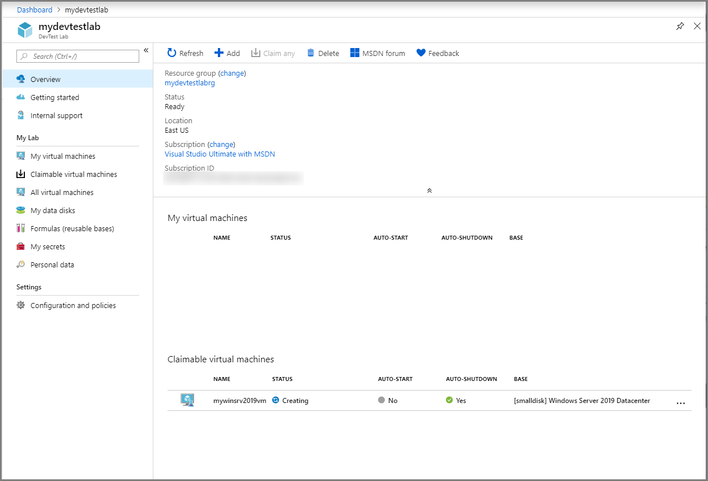

## Add an existing artifact to a VM

While creating a VM, you can add existing artifacts. Each lab includes artifacts from the Public DevTest Labs Artifact Repository as well as artifacts that you've created and added to your own Artifact Repository.

*   Azure DevTest Labs _artifacts_ let you specify _actions_ that are performed when the VM is provisioned, such as running Windows PowerShell scripts, running Bash commands, and installing software.
*   Artifact _parameters_ let you customize the artifact for your particular scenario

To discover how to create artifacts, see the article, [Learn how to author your own artifacts for use with DevTest Labs](devtest-lab-artifact-author).

1.  Sign in to the [Azure portal](https://go.microsoft.com/fwlink/p/?LinkID=525040).
2.  Select **All Services**, and then select **DevTest Labs** from the list.
3.  From the list of labs, select the lab containing the VM with which you want to work.
4.  Select **My virtual machines**.
5.  Select the desired VM.
6.  Select **Manage artifacts**.
7.  Select **Apply artifacts**.
8.  On the **Apply artifacts** pane, select the artifact you wish to add to the VM.
9.  On the **Add artifact** pane, enter the required parameter values and any optional parameters that you need.
10.  Select **Add** to add the artifact and return to the **Apply artifacts** pane.
11.  Continue adding artifacts as needed for your VM.
12.  Once you've added your artifacts, you can [change the order in which the artifacts are run](#change-the-order-in-which-artifacts-are-run). You can also go back to [view or modify an artifact](#view-or-modify-an-artifact).
13.  When you're done adding artifacts, select **Apply**

## Change the order in which artifacts are run

By default, the actions of the artifacts are executed in the order in which they are added to the VM. The following steps illustrate how to change the order in which the artifacts are run.

1.  At the top of the **Apply artifacts** pane, select the link indicating the number of artifacts that have been added to the VM.

    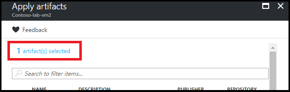

2.  On the **Selected artifacts** pane, drag and drop the artifacts into the desired order. **Note:** If you have trouble dragging the artifact, make sure that you are dragging from the left side of the artifact.

3.  Select **OK** when done.

## View or modify an artifact

The following steps illustrate how to view or modify the parameters of an artifact:

1.  At the top of the **Apply artifacts** pane, select the link indicating the number of artifacts that have been added to the VM.

    

2.  On the **Selected artifacts** pane, select the artifact that you want to view or edit.

3.  On the **Add artifact** pane, make any needed changes, and select **OK** to close the **Add artifact** pane.

4.  Select **OK** to close the **Selected artifacts** pane.

# Exercise 2: Use command-line tools to start and stop Azure DevTest Labs virtual machines

1.  [Overview](#overview)
2.  [Azure PowerShell](#azure-powershell)
3.  [Azure CLI](#azure-cli)

This article shows you how to use Azure PowerShell or Azure CLI to start or stop virtual machines in a lab in Azure DevTest Labs. You can create PowerShell/CLI scripts to automate these operations.

This article has been updated to use the new Azure PowerShell Az module. You can still use the AzureRM module, which will continue to receive bug fixes until at least December 2020. To learn more about the new Az module and AzureRM compatibility, see [Introducing the new Azure PowerShell Az module](/en-us/powershell/azure/new-azureps-module-az). For Az module installation instructions, see [Install Azure PowerShell](/en-us/powershell/azure/install-az-ps).

## Overview

Azure DevTest Labs is a way to create fast, easy, and lean dev/test environments. It allows you to manage cost, quickly provision VMs, and minimize waste. There are built-in features in the Azure portal that allow you to configure VMs in a lab to automatically start and stop at specific times.

However, in some scenarios, you may want to automate starting and stopping of VMs from PowerShell/CLI scripts. It gives you some flexibility with starting and stopping individual machines at any time instead of at specific times. Here are some of the situations in which running these tasks by using scripts would be helpful.

*   When using a 3-tier application as part of a test environment, the tiers need to be started in a sequence.
*   Turn off a VM when a custom criteria is met to save money.
*   Use it as a task within a CI/CD workflow to start at the beginning of the flow, use the VMs as build machines, test machines, or infrastructure, then stop the VMs when the process is complete. An example of this would be the custom image factory with Azure DevTest Labs.

## Azure PowerShell

The following PowerShell script starts a VM in a lab. [Invoke-AzResourceAction](/en-us/powershell/module/az.resources/invoke-azresourceaction?view=azps-1.7.0) is the primary focus for this script. The **ResourceId** parameter is the fully qualified resource ID for the VM in the lab. The **Action** parameter is where the **Start** or **Stop** options are set depending on what is needed.

    # The id of the subscription
    $subscriptionId = "111111-11111-11111-1111111"

    # The name of the lab
    $devTestLabName = "yourlabname"

    # The name of the virtual machine to be started
    $vMToStart = "vmname"

    # The action on the virtual machine (Start or Stop)
    $vmAction = "Start"

    # Select the Azure subscription
    Select-AzSubscription -SubscriptionId $subscriptionId

    # Get the lab information
    if ($(Get-Module -Name AzureRM).Version.Major -eq 6) {
        $devTestLab = Get-AzResource -ResourceType 'Microsoft.DevTestLab/labs' -Name $devTestLabName
    } else {
        $devTestLab = Find-AzResource -ResourceType 'Microsoft.DevTestLab/labs' -ResourceNameEquals $devTestLabName
    }

    # Start the VM and return a succeeded or failed status
    $returnStatus = Invoke-AzResourceAction `
                        -ResourceId "$($devTestLab.ResourceId)/virtualmachines/$vMToStart" `
                        -Action $vmAction `
                        -Force

    if ($returnStatus.Status -eq 'Succeeded') {
        Write-Output "##[section] Successfully updated DTL machine: $vMToStart, Action: $vmAction"
    }
    else {
        Write-Error "##[error]Failed to update DTL machine: $vMToStart, Action: $vmAction"
    }

## Azure CLI

The [Azure CLI](/en-us/cli/azure/get-started-with-azure-cli?view=azure-cli-latest) is another way to automate the starting and stopping of DevTest Labs VMs. Azure CLI can be [installed](/en-us/cli/azure/install-azure-cli?view=azure-cli-latest) on different operating systems. The following script gives you commands for starting and stopping a VM in a lab.

    # Sign in to Azure
    az login 

    ## Get the name of the resource group that contains the lab
    az resource list --resource-type "Microsoft.DevTestLab/labs" --name "yourlabname" --query "[0].resourceGroup" 

    ## Start the VM
    az lab vm start --lab-name yourlabname --name vmname --resource-group labResourceGroupName

    ## Stop the VM
    az lab vm stop --lab-name yourlabname --name vmname --resource-group labResourceGroupName

#Exercise 3: Restart a VM in a lab in Azure DevTest Labs

1.  [Steps to restart a VM in a lab in Azure DevTest Labs](#steps-to-restart-a-vm-in-a-lab-in-azure-devtest-labs)

You can quickly and easily restart a virtual machine in DevTest Labs by following the steps in this article. Consider the following before restarting a VM:

*   The VM must be running for the restart feature to be enabled.

*   If a user is connected to a running VM when they perform a restart, they must reconnect to the VM after it starts back up.

*   If an artifact is being applied when you restart the VM, you receive a warning that the artifact might not be applied.

    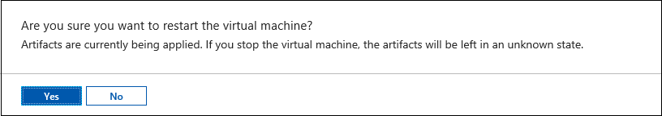

    If the VM has stalled while applying an artifact, you can use the restart VM feature as a potential way to resolve the issue.

## Steps to restart a VM in a lab in Azure DevTest Labs

1.  Sign in to the [Azure portal](https://go.microsoft.com/fwlink/p/?LinkID=525040).

2.  Select **All Services**, and then select **DevTest Labs** from the list.

3.  From the list of labs, select the lab that includes the VM you want to restart.

4.  In the left panel, select **My Virtual Machines**.

5.  From the list of VMs, select a running VM.

6.  At the top of the VM management pane, select **Restart**.

    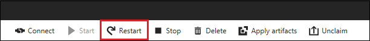

7.  Monitor the status of the restart by selecting the **Notifications** icon at the top right of the window.

    

You can also restart a running VM by selecting its ellipsis (...) in the list of **My Virtual Machines**.

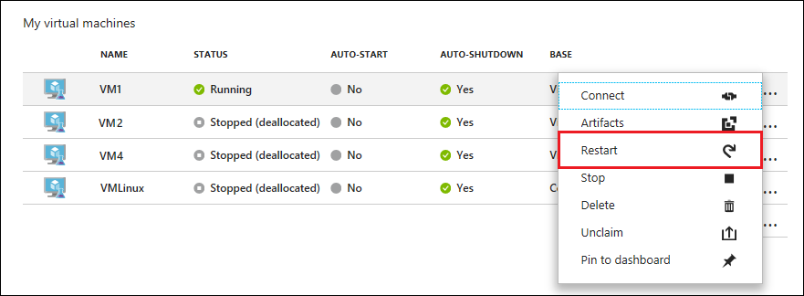

#Exercise 4: Resize a VM in a lab in Azure DevTest Labs

1.  [Steps to resize a VM in a lab](#steps-to-resize-a-vm-in-a-lab)
2.  [Next steps](#next-steps)

One of the important features of Azure virtual machines is that it lets you change the size of a virtual machine (VM) based on your needs for CPU, network, or disk performance. Azure DevTest Labs supports this feature for VMs in a lab now. The resize feature adheres to the lab policy for allowed VM sizes in the lab. That is, you can change the size of a VM to only allowed sizes in the lab.

## Steps to resize a VM in a lab

To resize a VM in a lab in Azure DevTest Labs, take the following steps:

Note

If you are connected to the VM via a remote desktop session (RDP), save your work, and disconnect from the VM before resizing it.

1.  Sign in to the [Azure portal](https://portal.azure.com).

2.  Select **All Services**, and then select **DevTest Labs** from the list.

3.  From the list of labs, select the lab that includes the VM you want to resize.

4.  In the left panel, select **My Virtual Machines**.

5.  From the list of VMs, select a VM.

6.  Select **Stop** on the toolbar if the VM is running. Check the status of the operation in the **Notifications** window. Wait until the VM is stopped and then close the **Notifications** window.

    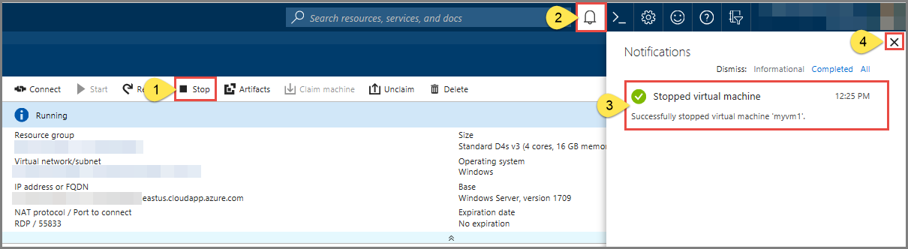

7.  In the Virtual Machine page for your VM, select **Size** under **SETTINGS** in the left menu.

    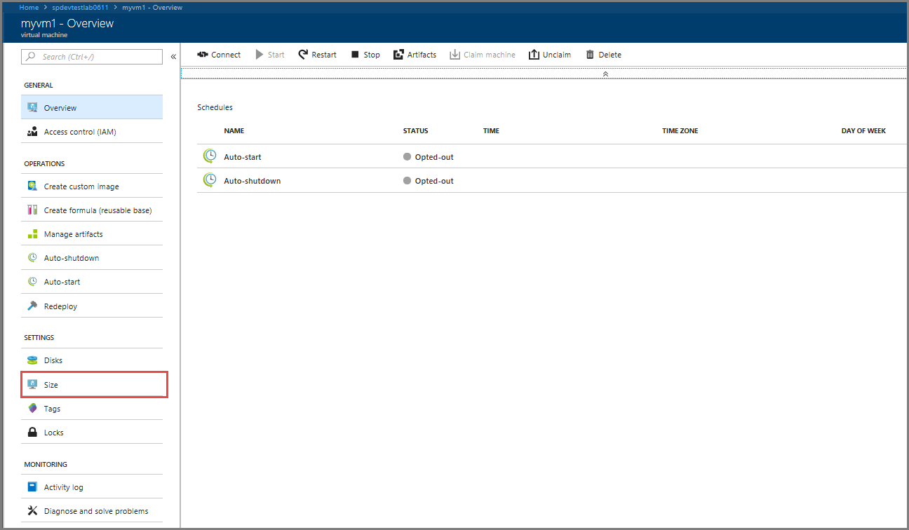

8.  In the **Choose a size** window, browse and select a size for your VM, and click **Select**.

9.  Check the status of the resize operation in the **Notifications** window.

    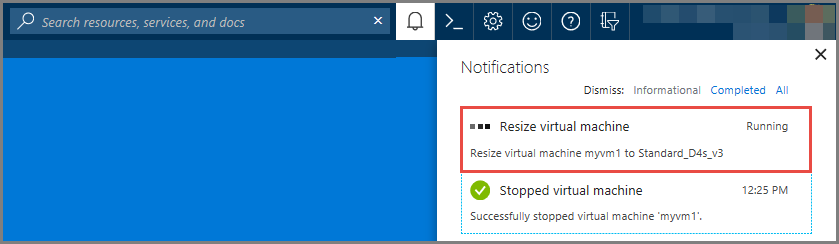

10.  After the resize operation succeeds, close the **Notifications** window.

11.  Select **Overview** in the left menu, and select **Restart** on the toolbar to restart the VM.

#Exercise 5: Redeploy a VM in a lab in Azure DevTest Labs

1.  [Steps to redeploy a VM in a lab](#steps-to-redeploy-a-vm-in-a-lab)

If you can't connect to a virtual machine (VM) in a lab via a remote desktop connection, redeploy the VM and try connecting to it again. When you redeploy a VM, DevTest Labs moves the VM from the node on which it's running to a new node within the Azure infrastructure. It then starts the VM while retaining all your configuration options and associated resources. This feature saves you the time spent in troubleshooting your remote desktop connection or application access to Windows-based VMs in the lab.

## Steps to redeploy a VM in a lab

To redeploy a VM in a lab in Azure DevTest Labs, take the following steps:

1.  Sign in to the [Azure portal](https://portal.azure.com).

2.  Select **All Services**, and then select **DevTest Labs** from the list.

3.  From the list of labs, select the lab that includes the VM you want to redeploy.

4.  In the left panel, select **My Virtual Machines**.

5.  From the list of VMs, select a VM.

6.  In the Virtual Machine page for your VM, select **Redeploy** under **OPERATIONS** in the left menu.

    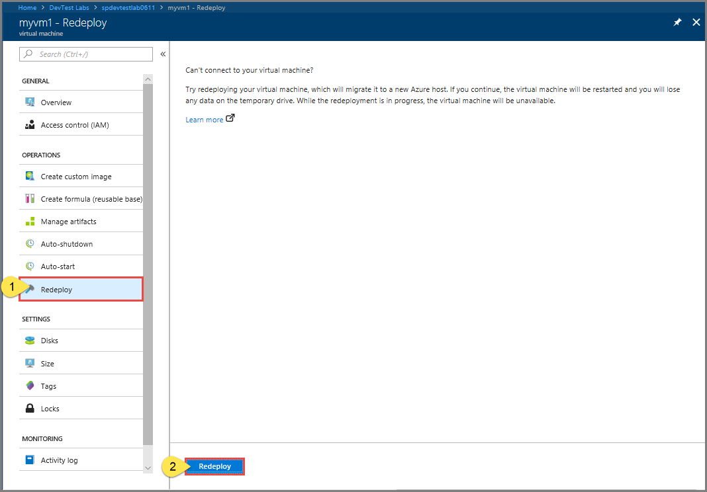

7.  Read the information on the page, and select **Redeploy** button. 9\. Check the status of the redeploy operation in the **Notifications** window.

    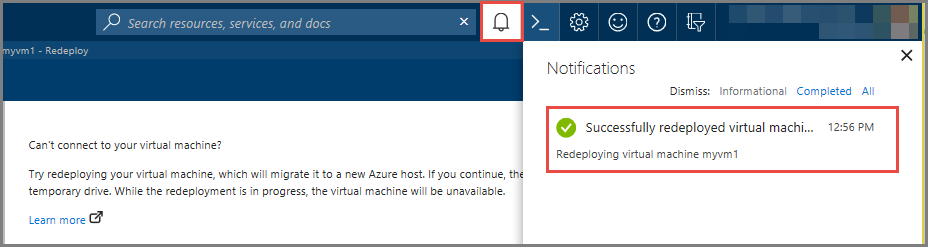

#Exercise 6: Configure autoshutdown settings for a VM in Azure DevTest Labs

1.  [Autoshutdown policy for a lab](#autoshutdown-policy-for-a-lab)
2.  [Configure autoshutdown settings for a lab](#configure-autoshutdown-settings-for-a-lab)
3.  [Configure autoshutdown settings for a VM](#configure-autoshutdown-settings-for-a-vm)
4.  [Notifications](#notifications)

Azure DevTest Labs enables you to control cost and minimize waste in your labs by managing policies (settings) for each lab. This article shows you how to configure autoshutdown policy for a lab account and configure autoshutdown settings for a lab in the lab account. To view how to set every lab policy, see [Define lab policies in Azure DevTest Labs](devtest-lab-set-lab-policy).

## Autoshutdown policy for a lab

As a lab owner, you can configure a shutdown schedule for all the VMs in your lab. By doing so, you can save costs from running machines that aren't being used (idle). You can enforce a shutdown policy on all your lab VMs centrally but also save your lab users the effort from setting up a schedule for their individual machines. This feature enables you to set the policy on your lab schedule starting from offering no control to full control, to your lab users. As a lab owner, you can configure this policy by taking the following steps:

1.  On the home page for your lab, select **Configuration and policies**.

2.  Select **Auto shutdown policy** in the **Schedules** section of the left menu.

3.  Select one of the options. The following sections give you more details about these options: The set policy applies only to new VMs created in the lab and not to the already existing VMs.

    

## Configure autoshutdown settings for a lab

The autoshutdown policy helps to minimize lab waste by allowing you to specify the time that this lab's VMs shut down.

To view (and change) the policies for a lab, follow these steps:

1.  Sign in to the [Azure portal](https://portal.azure.com).

2.  Select **All services**, and then select **DevTest Labs** from the list.

3.  From the list of labs, select the desired lab.

4.  Select **Configuration and policies**.

    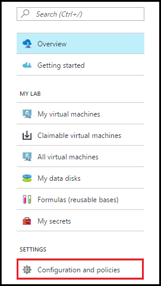

5.  On the lab's **Configuration and policies** pane, select **Auto-shutdown** under **Schedules**.

    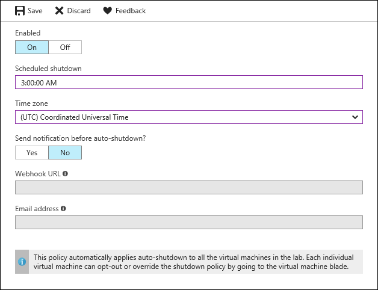

6.  Select **On** to enable this policy, and **Off** to disable it.

7.  If you enable this policy, specify the time (and time zone) to shut down all VMs in the current lab.

8.  Specify **Yes** or **No** for the option to send a notification 15 minutes prior to the specified autoshutdown time. If you choose **Yes**, enter a webhook URL endpoint or email address specifying where you want the notification to be posted or sent. The user receives notification and is given the option to delay the shutdown. For more information, see the [Notifications](#notifications) section.

9.  Select **Save**.

    By default, once enabled, this policy applies to all VMs in the current lab. To remove this setting from a specific VM, open the VM's management pane and change its **Autoshutdown** setting.

## Configure autoshutdown settings for a VM

### User sets a schedule and can opt out

If this policy option is set for the lab, users can override or opt out of the lab schedule. This option grants lab users full control over auto shutdown schedule of their VMs. Lab users see no change in their VM auto shutdown schedule page.

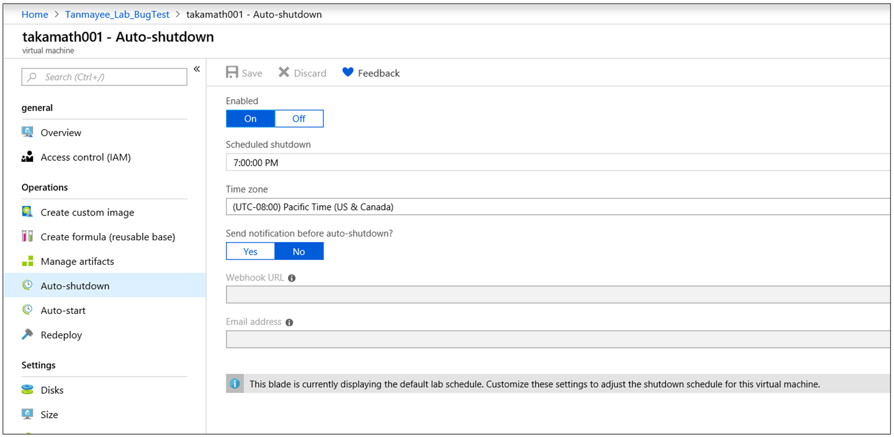

### User sets a schedule and cannot opt out

If this policy option is set for the lab, users can override the lab schedule. However, they can't opt out of auto shutdown policy. This option makes sure that every machine in your lab is under an auto shutdown schedule. Lab users can update auto shutdown schedule of their VMs, and set up shut down notifications.

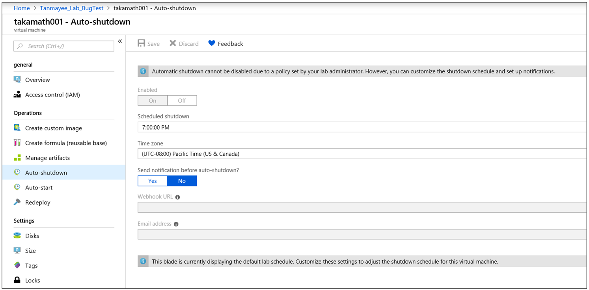

### User has no control over the schedule set by lab admin

If this policy option is set for the lab, users can't override or opt out of the lab schedule. This option offers lab admin the complete control on the schedule for every machine in the lab. Lab users can only set up auto shutdown notifications for their VMs.

## Notifications

Once autoshutdown set up by the lab owner, notifications will be sent to the lab users 15 minutes before the autoshutdown triggered if any of their VMs will be affected. This option gives lab users a chance to save their work before the shutdown. The notification also provides links for each VM for the following actions:

*   Skip the autoshutdown for this time
*   Snooze the autoshutdown for an hour or 2 hours, so that they can keep working on the VM.

Notification is sent through the configured web hook endpoint or an email address specified by lab owners in the autoshutdown settings. Webhooks allow you to build or set up integrations that subscribe to certain events. When one of those events is triggered, DevTest Labs will send an HTTP POST payload to the webhook's configured URL. For more information about webhooks, see [Create a webhook or API Azure Function](../azure-functions/functions-create-a-web-hook-or-api-function).

We recommend you to use web hooks because they're extensively supported by various apps (for example, Slack, Azure Logic Apps, and so on.) and allows you to implement your own way for sending notifications. For an example of receiving autoshutdown notification from emails by using Azure Logic Apps, see[Create a logic app that receives email notifications](devtest-lab-auto-shutdown#create-a-logic-app-that-receives-email-notifications).

#Exercise 7: Create and manage claimable VMs in Azure DevTest Labs

*   5 minutes to read

### In this article

1.  [Steps to add a claimable VM to a lab in Azure DevTest Labs](#steps-to-add-a-claimable-vm-to-a-lab-in-azure-devtest-labs)
2.  [Using a claimable VM](#using-a-claimable-vm)
3.  [Unclaim a VM](#unclaim-a-vm)

You add a claimable VM to a lab in a similar manner to how you [add a standard VM](devtest-lab-add-vm) – from a _base_ that is either a [custom image](devtest-lab-create-template), [formula](devtest-lab-manage-formulas), or [Marketplace image](devtest-lab-configure-marketplace-images). This tutorial walks you through using the Azure portal to add a claimable VM to a lab in DevTest Labs, and shows the processes a user follows to claim and unclaim the VM.

## Steps to add a claimable VM to a lab in Azure DevTest Labs

1.  Sign in to the [Azure portal](https://go.microsoft.com/fwlink/p/?LinkID=525040).

2.  Select **All Services**, and then select **DevTest Labs** in the **DEVOPS** section. If you select * (star) next to **DevTest Labs** in the **DEVOPS** section. This action adds **DevTest Labs** to the left navigational menu so that you can access it easily the next time. Then, you can select **DevTest Labs** on the left navigational menu.

    .png)

3.  From the list of labs, select the lab in which you want to create the VM.

4.  On the lab's **Overview** page, select **+ Add**.

    .png)

5.  On the **Choose a base** page, select a marketplace image for the VM.

6.  On the **Basic Settings** tab of the **Virtual machine** page, do the following actions:

    1.  Enter a name for the VM in the **Virtual machine name** text box. The text box is pre-filled for you with a unique auto-generated name. The name corresponds to the user name within your email address followed by a unique 3-digit number. This feature saves you the time to think of a machine name and type it every time you create a machine. You can override this auto-filled field with a name of your choice if you wish to. To override the auto-filled name for the VM, enter a name in the **Virtual machine name** text box.

    2.  Enter a **User Name** that is granted administrator privileges on the virtual machine. The **user name** for the machine is pre-filled with a unique auto-generated name. The name corresponds to the user name within your email address. This feature saves you the time to decide on a username every time you create a new machine. Again, you can override this auto-filled field with a username of your choice if you wish to. To override the auto-filled value for user name, enter a value in the **User Name** text box. This user is granted **administrator** privileges on the virtual machine.

    3.  If you are creating first VM in the lab, enter a **password** for the user. To save this password as a default password in the Azure key vault associated with the lab, select **Save as default password**. The default password is saved in the key vault with the name: **VmPassword**. When you try to create subsequent VMs in the lab, **VmPassword** is automatically selected for the **password**. To override the value, clear the **Use a saved secret** check box, and enter a password.

        You can also save secrets in the key vault first and then use it while creating a VM in the lab. For more information, see [Store secrets in a key vault](devtest-lab-store-secrets-in-key-vault). To use the password stored in the key vault, select **Use a saved secret**, and specify a key value that corresponds to your secret (password).

    4.  In the **More options** section, select **Change size**. Select one of the predefined items that specify the processor cores, RAM size, and the hard drive size of the VM to create.

    5.  Select **Add or Remove Artifacts**. Select and configure the artifacts that you want to add to the base image. **Note:** If you're new to DevTest Labs or configuring artifacts, refer to the [Add an existing artifact to a VM](devtest-lab-add-vm#add-an-existing-artifact-to-a-vm) section, and then return here when finished.

7.  Switch to the **Advanced Settings** tab at the top, and do the following actions:

    1.  To change the virtual network that the VM is in, select **Change VNet**.
    2.  To change the subnet, select **Change subnet**.
    3.  Specify whether the IP address of the VM is **public, private, or shared**.
    4.  To automatically delete the VM, specify the **expiration date and time**.
    5.  To make the VM claimable by a lab user, select **Yes** for **Make this machine claimable** option.
    6.  Specify the number of the **instances of VM** that you want to make it available to your lab users.
8.  Select **Create** to add the specified VM to the lab.

    The lab page displays the status of the VM's creation - first as **Creating**, then as **Running** after the VM has been started.

If you deploy lab VMs through [Azure Resource Manager templates](devtest-lab-create-environment-from-arm), you can create claimable VMs by setting the **allowClaim** property to true in the properties section.

## Using a claimable VM

A user can claim any VM from the list of "Claimable virtual machines" by doing one of these steps:

*   From the list of "Claimable virtual machines" at the bottom of the lab's "Overview" pane, right-click on one of the VMs in the list and choose **Claim machine**.

    

*   At the top of the "Overview" pane, choose **Claim any**. A random virtual machine is assigned from the list of claimable VMs.

    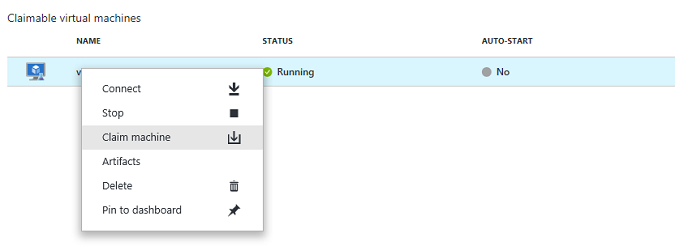

After a user claims a VM, it is moved up into their list of "My virtual machines" and is no longer claimable by any other user.

## Unclaim a VM

When a user is finished using a claimed VM and wants to make it available to someone else, they can return the claimed VM to the list of claimable virtual machines by doing one of these steps:

*   From the list of "My virtual machines", right-click on one of the VMs in the list – or select its ellipsis (...) – and choose **Unclaim**.

    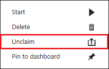

*   In the list of "My virtual machines", select a VM to open its management pane, then select **Unclaim** from the top menu bar.

    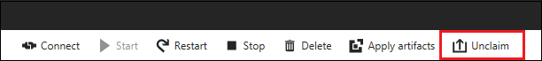

When a user unclaims a VM, they no longer have any permissions for that specific lab VM.

### Transferring the data disk

If a claimable VM has a data disk attached to it and a user unclaims it, the data disk stays with the VM. When another user then claims that VM, that new user claims the data disk as well as the VM.

This is known as "transferring the data disk". The data disk then becomes available in the new user's list of **My data disks** for them to manage.

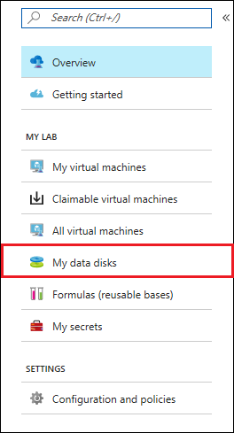

#Exercise 8: Store secrets in a key vault in Azure DevTest Labs

1.  [Save a secret in Azure Key Vault](#save-a-secret-in-azure-key-vault)
2.  [Use a secret from Azure Key Vault](#use-a-secret-from-azure-key-vault)
3.  [Use a secret in an Azure Resource Manager template](#use-a-secret-in-an-azure-resource-manager-template)

You may need to enter a complex secret when using Azure DevTest Labs: password for your Windows VM, public SSH key for your Linux VM, or personal access token to clone your Git repo through an artifact. Secrets are usually long and have random characters. Therefore, entering them can be tricky and inconvenient, especially if you use the same secret multiple times.

To solve this problem and also keep your secrets in a safe place, DevTest Labs supports storing secrets in an [Azure key vault](../key-vault/key-vault-overview). When a user saves a secret for the first time, the DevTest Labs service automatically creates a key vault in the same resource group that contains the lab and stores the secret in the key vault. DevTest Labs creates a separate key vault for each user.

## Save a secret in Azure Key Vault

To save your secret in Azure Key Vault, do the following steps:

1.  Select **My secrets** on the left menu.

2.  Enter a **name** for the secret. You see this name in the drop-down list when creating a VM, formula, or an environment.

3.  Enter the secret as the **value**.

    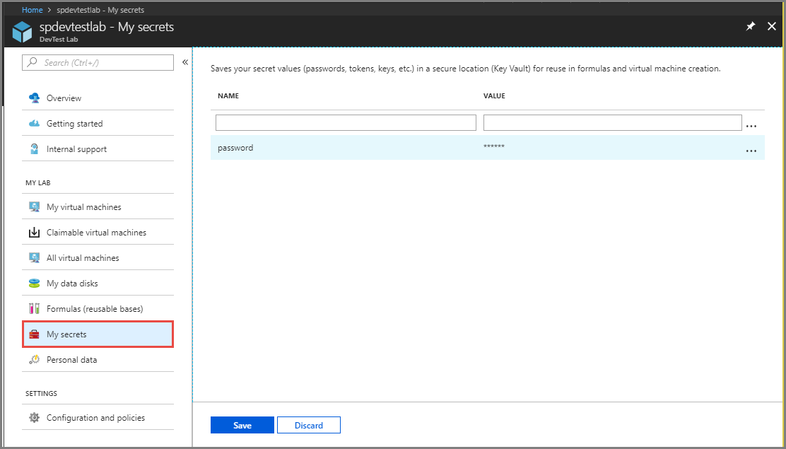

## Use a secret from Azure Key Vault

When you need to enter a secret to create a VM, formula, or an environment, you can either enter a secret manually or select a saved secret from the key vault. To use a secret stored in your key vault, do the following actions:

1.  Select **Use a saved secret**.

2.  Select your secret from the drop-down list for **Pick a secret**.

    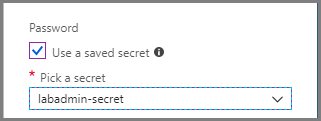

## Use a secret in an Azure Resource Manager template

You can specify your secret name in an Azure Resource Manager template that's used to create a VM as shown in the following example:

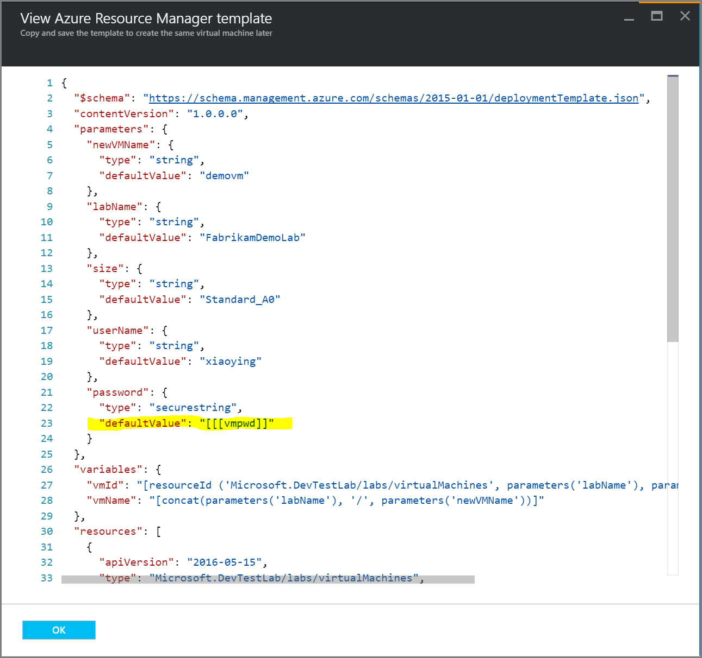

#Exercise 9: Attach or detach a data disk to a virtual machine in Azure DevTest Labs

1.  [Attach a data disk](#attach-a-data-disk)
2.  [Detach a data disk](#detach-a-data-disk)
3.  [Upgrade an unmanaged data disk](#upgrade-an-unmanaged-data-disk)
4.  [Get started with Azure DevTest Labs](#get-started-with-azure-devtest-labs)

[Azure Managed Disks](https://docs.microsoft.com/azure/virtual-machines/windows/managed-disks-overview) manages the storage accounts associated with virtual machine data disks. A user attaches a new data disk to a VM, specifies the type and size of disk that's needed, and Azure creates and manages the disk automatically. The data disk can then be detached from the VM and either reattached later to the same VM, or attached to a different VM that belongs to the same user.

This functionality is handy for managing storage or software outside of each individual virtual machine. If the storage or software already exists inside a data disk, it can be easily attached, detached, and reattached to any VM that is owned by the user that owns that data disk.

## Attach a data disk

Before you attach a data disk to a VM, review these tips:

*   The size of the VM controls how many data disks you can attach. For details, see [Sizes for virtual machines](https://docs.microsoft.com/azure/virtual-machines/windows/sizes).
*   You can only attach a data disk to a VM that is running. Make sure the VM is running before you try to attach a data disk.

### Attach a new disk

Follow these steps to create and attach a new managed data disk to a VM in Azure DevTest Labs.

1.  Sign in to the [Azure portal](https://go.microsoft.com/fwlink/p/?LinkID=525040).

2.  Select **All Services**, and then select **DevTest Labs** from the list.

3.  From the list of labs, select the desired lab.

4.  From the list of **My virtual machines**, select a running VM.

5.  From the menu on the left, select **Disks**.

    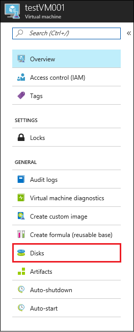

6.  Choose **Attach new** to create a new data disk and attach it to the VM.

    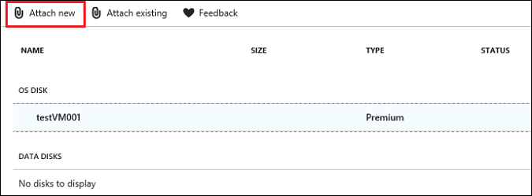

7.  Complete the **Attach new disk** pane by entering a data disk name, type, and size.

    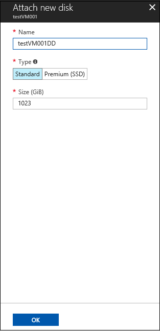

8.  Select **OK**.

After a few moments, the new data disk is created and attached to the VM and appears in the list of **DATA DISKS** for that VM.

### Attach an existing disk

Follow these steps to reattach an existing available data disk to a running VM.

1.  Select a running VM for which you want to reattach a data disk.

2.  From the menu on the left, select **Disks**.

3.  Select **Attach existing** to attach an available data disk to the VM.

    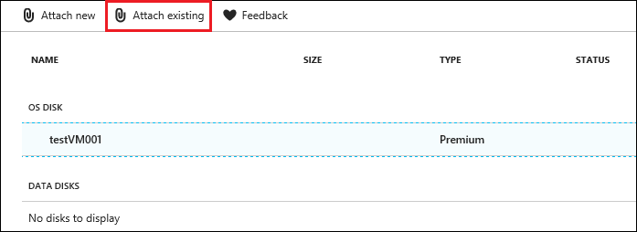

4.  From the **Attach existing disk** pane, select OK.

    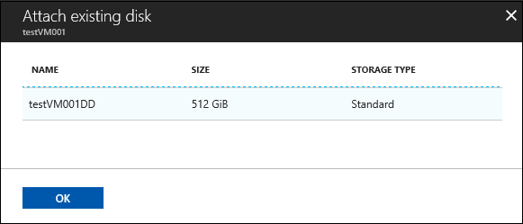

After a few moments, the data disk is attached to the VM and appears in the list of **DATA DISKS** for that VM.

## Detach a data disk

When you no longer need a data disk that's attached to a VM, you can easily detach it. Detaching removes the disk from the VM, but keeps it in storage for use later.

If you want to use the existing data on the disk again, you can reattach it to the same virtual machine or to another one.

### Detach from the VM's management pane

1.  From your list of virtual machines, select a VM that has a data disk attached.

2.  From the menu on the left, select **Disks**.

    .png)

3.  From the list of **Data Disks**, select the data disk that you want to detach.

4.  Select **Detach** from the top of the disk's details pane.

    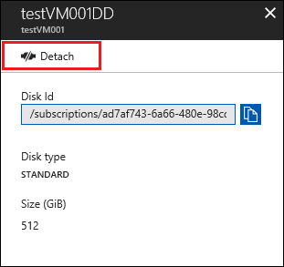

5.  Select **Yes** to confirm that you want to detach the data disk.

The disk is detached and is available to attach to another VM.

### Detach from the lab's main pane

1.  On your lab's main pane, select **My data disks**.

    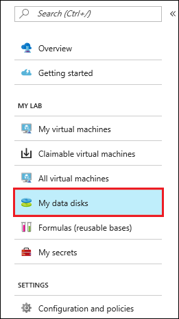

2.  Right-click the data disk you want to detach – or select its ellipsis (...) – and choose **Detach**.

    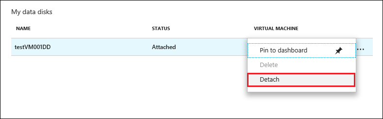

3.  Select **Yes** to confirm that you want to detach it.

    If a data disk is already detached, you can choose to remove it from your list of available data disks by selecting **Delete**.

## Upgrade an unmanaged data disk

If you have an existing VM that uses unmanaged data disks, you can easily convert the VM to use managed disks. This process converts both the OS disk and any attached data disks.

To upgrade an unmanaged data disk, follow the steps outlined in this article to [detach the data disk](#detach-a-data-disk) from an unmanaged VM. Then, [reattach the disk](#attach-an-existing-disk) to a managed VM to automatically upgrade the data disk from unmanaged to managed.

