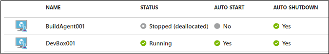
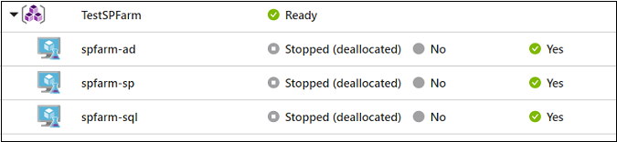
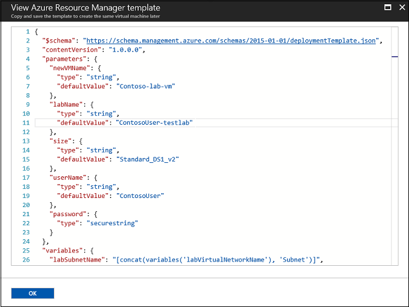
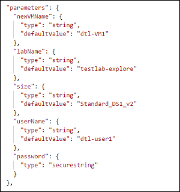

# Welcome to DevTest Labs

## Conditions and Terms of Use Microsoft Confidential - For Internal Use Only

This training package is proprietary and confidential, and is intended only for uses described in the training materials. Content and software is provided to you under a Non-Disclosure Agreement and cannot be distributed. Copying or disclosing all or any portion of the content and/or software included in such packages is strictly prohibited.

The contents of this package are for informational and training purposes only and are provided "as is" without warranty of any kind, whether express or implied, including but not limited to the implied warranties of merchantability, fitness for a particular purpose, and non-infringement.

Training package content, including URLs and other Internet Web site references, is subject to change without notice. Because Microsoft must respond to changing market conditions, the content should not be interpreted to be a commitment on the part of Microsoft, and Microsoft cannot guarantee the accuracy of any information presented after the date of publication. Unless otherwise noted, the companies, organizations, products, domain names, e-mail addresses, logos, people, places, and events depicted herein are fictitious, and no association with any real company, organization, product, domain name, e-mail address, logo, person, place, or event is intended or should be inferred.

**Copyright and Trademarks**

Microsoft may have patents, patent applications, trademarks, copyrights, or other intellectual property rights covering subject matter in this document. Except as expressly provided in written license agreement from Microsoft, the furnishing of this document does not give you any license to these patents, trademarks, copyrights, or other intellectual property.

Complying with all applicable copyright laws is the responsibility of the user. Without limiting the rights under copyright, no part of this document may be reproduced, stored in or introduced into a retrieval system, or transmitted in any form or by any means (electronic, mechanical, photocopying, recording, or otherwise), or for any purpose, without the express written permission of Microsoft Corporation.

For more information, see Use of Microsoft Copyrighted Content at [(http://www.microsoft.com/about/legal/permissions/)](http://www.microsoft.com/about/legal/permissions/)

Microsoft®, Internet Explorer®, and Windows® are either registered trademarks or trademarks of Microsoft Corporation in the United States and/or other countries. Other Microsoft products mentioned herein may be either registered trademarks or trademarks of Microsoft Corporation in the United States and/or other countries. All other trademarks are property of their respective owners.

© 2019 Microsoft Corporation.  All rights reserved.

# Create virtual machines using an Azure Resource Manager template

### In this article

1.  [Multi-VM vs. single-VM Resource Manager templates](#multi-vm-vs-single-vm-resource-manager-templates)
2.  [View and save a virtual machine's Resource Manager template](#view-and-save-a-virtual-machines-resource-manager-template)
3.  [Set expiration date](#set-expiration-date)

When you are creating a virtual machine (VM) in DevTest Labs through the [Azure portal](https://go.microsoft.com/fwlink/p/?LinkID=525040), you can view the Azure Resource Manager template before you save the VM. The template can then be used as a basis to create more lab VMs with the same settings.

This article describes Multi-VM vs. single-VM Resource Manager templates and shows you how to view and save a template when creating a VM.

Note:

This article has been updated to use the new Azure PowerShell Az module. You can still use the AzureRM module, which will continue to receive bug fixes until at least December 2020. To learn more about the new Az module and AzureRM compatibility, see [Introducing the new Azure PowerShell Az module](/en-us/powershell/azure/new-azureps-module-az). For Az module installation instructions, see [Install Azure PowerShell](/en-us/powershell/azure/install-az-ps).

## Multi-VM vs. single-VM Resource Manager templates

There are two ways to create VMs in DevTest Labs using a Resource Manager template: provision the Microsoft.DevTestLab/labs/virtualmachines resource or provision the Microsoft.Compute/virtualmachines resource. Each is used in different scenarios and requires different permissions.

*   Resource Manager templates that use a Microsoft.DevTestLab/labs/virtualmachines resource type (as declared in the “resource” property in the template) can provision individual lab VMs. Each VM then shows up as a single item in the DevTest Labs virtual machines list:

    

    This type of Resource Manager template can be provisioned through the Azure PowerShell command **New-AzResourceGroupDeployment** or through the Azure CLI command **az group deployment create**. It requires administrator permissions, so users who are assigned with a DevTest Labs user role can’t perform the deployment.

*   Resource Manager templates that use a Microsoft.Compute/virtualmachines resource type can provision multiple VMs as a single environment in the DevTest Labs virtual machines list:

    

    VMs in the same environment can be managed together and share the same lifecycle. Users who are assigned with a DevTest Labs user role can create environments using those templates as long as the administrator has configured the lab that way.

The remainder of this article discusses Resource Manager templates that use Microsoft.DevTestLab/labs/virtualmachines. These are used by lab admins to automate lab VM creation (for example, claimable VMs) or golden image generation (for example, image factory).

[Best practices for creating Azure Resource Manager templates](https://docs.microsoft.com/azure/azure-resource-manager/resource-manager-template-best-practices) offers many guidelines and suggestions to help you create Azure Resource Manager templates that are reliable and easy to use.

## View and save a virtual machine's Resource Manager template

1.  Follow the steps at [Create your first VM in a lab](tutorial-create-custom-lab#add-a-vm-to-the-lab) to begin creating a virtual machine.

2.  Enter the required information for your virtual machine and add any artifacts you want for this VM.

3.  Swtich to the **Advanced Settings** tab.

4.  At the bottom of the Configure settings window, choose **View ARM template**.

5.  Copy and save the Resource Manager template to use later to create another virtual machine.

    

After you have saved the Resource Manager template, you must update the parameters section of the template before you can use it. You can create a parameter.json that customizes just the parameters, outside of the actual Resource Manager template.

The Resource Manager template is now ready to use to [create a VM](devtest-lab-create-environment-from-arm).

## Set expiration date

In scenarios such as training, demos and trials, you may want to create virtual machines and delete them automatically after a fixed duration so that you don’t incur unnecessary costs. You can create a lab VM with an expiration date by specifying the **expirationDate** property for the VM. Check out the same Resource Manager template in [our GitHub repository](https://github.com/Azure/azure-devtestlab/tree/master/samples/DevTestLabs/QuickStartTemplates/101-dtl-create-vm-username-pwd-customimage-with-expiration).

