# Welcome to DevTest Lab - Managing Environments and Resources


## Conditions and Terms of Use Microsoft Confidential - For Internal Use Only

This training package is proprietary and confidential, and is intended only for uses described in the training materials. Content and software is provided to you under a Non-Disclosure Agreement and cannot be distributed. Copying or disclosing all or any portion of the content and/or software included in such packages is strictly prohibited.

The contents of this package are for informational and training purposes only and are provided "as is" without warranty of any kind, whether express or implied, including but not limited to the implied warranties of merchantability, fitness for a particular purpose, and non-infringement.

Training package content, including URLs and other Internet Web site references, is subject to change without notice. Because Microsoft must respond to changing market conditions, the content should not be interpreted to be a commitment on the part of Microsoft, and Microsoft cannot guarantee the accuracy of any information presented after the date of publication. Unless otherwise noted, the companies, organizations, products, domain names, e-mail addresses, logos, people, places, and events depicted herein are fictitious, and no association with any real company, organization, product, domain name, e-mail address, logo, person, place, or event is intended or should be inferred.

**Copyright and Trademarks**

Microsoft may have patents, patent applications, trademarks, copyrights, or other intellectual property rights covering subject matter in this document. Except as expressly provided in written license agreement from Microsoft, the furnishing of this document does not give you any license to these patents, trademarks, copyrights, or other intellectual property.

Complying with all applicable copyright laws is the responsibility of the user. Without limiting the rights under copyright, no part of this document may be reproduced, stored in or introduced into a retrieval system, or transmitted in any form or by any means (electronic, mechanical, photocopying, recording, or otherwise), or for any purpose, without the express written permission of Microsoft Corporation.

For more information, see Use of Microsoft Copyrighted Content at [(http://www.microsoft.com/about/legal/permissions/)](http://www.microsoft.com/about/legal/permissions/)

Microsoft®, Internet Explorer®, and Windows® are either registered trademarks or trademarks of Microsoft Corporation in the United States and/or other countries. Other Microsoft products mentioned herein may be either registered trademarks or trademarks of Microsoft Corporation in the United States and/or other countries. All other trademarks are property of their respective owners.

© 2019 Microsoft Corporation.  All rights reserved.

# Module 3 Lab - Managing Environments and Resources

## In this lab using the Azure Portal you will

1.  [Create an environment](#lab01-create-environment)
2.  [Use Platform-as-a-Service (PaaS) services](#lab2-use-platform-as-a-service)
3.  [Public Environments](#lab03-use-public-environments)
4.  [Create your own template repository](#configure-your-own-template-repositories)
5.  [Connect an environment to your lab's virtual network](#lab04-connect-virtual-network)
6.  [Configure test environments with nested templates](#lab05-deploy-nested-templates)

## Acknowledgement

Azure DevTest Labs environments allow users to readily deploy complex infrastructures in a consistent way within the confines of the lab. You can use [Azure Resource Manager templates](../azure-resource-manager/resource-group-authoring-templates.md) to create environments with sets of resources in DevTest Labs. These environments can contain any Azure resources that Resource Manager templates can create. 

You can easily [add one virtual machine (VM) at a time](devtest-lab-add-vm.md) to a lab by using the [Azure portal](https://portal.azure.com). However, scenarios like multi-tier web apps or a SharePoint farm need a mechanism to create multiple VMs in a single step. By using Azure Resource Manager templates, you can define the infrastructure and configuration of your Azure solution, and repeatedly deploy multiple VMs in a consistent state. 

Azure Resource Manager templates also provide the following benefits:

- Azure Resource Manager templates are loaded directly from your GitHub or Azure Repos source control repository.
- Your users can create an environment by picking a configured Azure Resource Manager template from the Azure portal, just as they do with other types of [VM bases](devtest-lab-comparing-vm-base-image-types.md).
- You can provision Azure PaaS resources as well as IaaS VMs in an environment from an Azure Resource Manager template.
- You can track the cost of environments in the lab, in addition to individual VMs created by other types of bases. PaaS resources are created and will appear in cost tracking. However, VM auto shutdown does not apply to PaaS resources.

To learn more about the benefits of using Resource Manager templates to deploy, update, or delete many lab resources in a single operation, see [Benefits of using Resource Manager templates](../azure-resource-manager/resource-group-overview.md#the-benefits-of-using-resource-manager).

> [!NOTE]
> When you use a Resource Manager template as a base to create lab VMs, there are some differences between creating multiple VMs or a single VM. For more information, see [Use a virtual machine's Azure Resource Manager template](devtest-lab-use-resource-manager-template.md).
>


<a name="lab1a-automate-deployment-of-environments"></a> 
## Exercise 1 - Create environment and PaaS resources with Azure Resource Manager templates with Azure Portal[](#lab01-create-environment)

Once you add an Azure Resource Manager template to the lab, your lab users can create environments in the Azure portal by following these steps:

1. Sign in to the [Azure portal](https://portal.azure.com).
   
1. Select **All Services**, and then select **DevTest Labs** from the list.
   
1. From the list of labs, select the lab you want. 
   
1. On the lab's page, select **Add**.
   
1. The **Choose a base** pane displays the base images you can use, with the Azure Resource Manager templates listed first. Select the Azure Resource Manager template you want.
   
   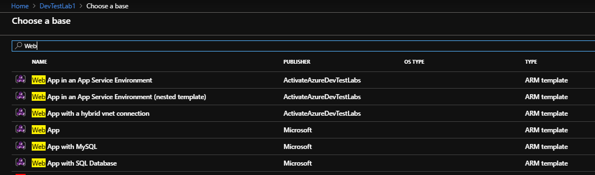
   
1. On the **Add** pane, enter an **Environment name** value to display to environment users. 
   
   The Azure Resource Manager template defines the rest of the input fields. If the template *azuredeploy.parameter.json* file defines default values, the input fields show those values. 
   
   For parameters of type *secure string*, you can use secrets from your Azure Key Vault. To learn about storing secrets in a key vault and using them when creating lab resources, see [Store secrets in Azure Key Vault](devtest-lab-store-secrets-in-key-vault.md).  
   
   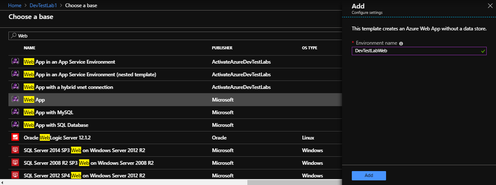
   
   
1. Select **Add** to create the environment. 
   
   The environment starts provisioning immediately, with the status displaying in the **My virtual machines** list. The lab automatically creates a new resource group to provision all the resources defined in the Azure Resource Manager template.
   
1. Once the environment is created, select the environment in the **My virtual machines** list to open the resource group pane and browse all of the resources the environment provisioned.
You can also expand the environment to view just the list of VMs the environment provisioned.
   
   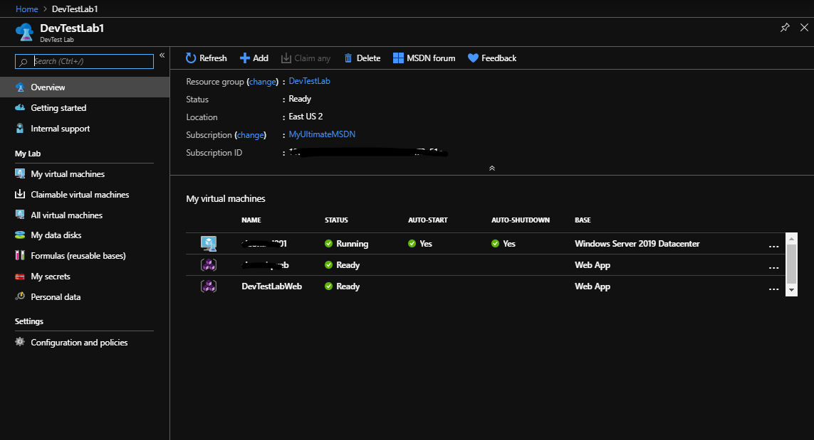
   
1. Select any of the environments to view the available actions.  For virtual machines you'll be able to apply artifacts, attach/detach data disks, changing auto-shutdown time, and more.   For PaaS resources you'll navigate to the resource group and have full access to those provisioned resources.
   
   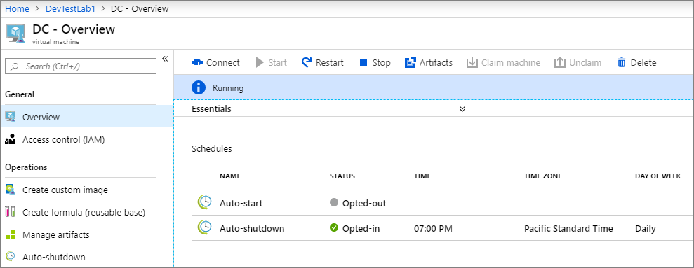


<a name="lab2-use-platform-as-a-service"></a> 
## Exercise 2 - Use Platform-as-a-Service (PaaS) services

PaaS is supported in DevTest Labs via the environments feature. Environments in DevTest Labs are supported by pre-configured Azure Resource Manager templates in a Git repository. Environments can contain both PaaS and IaaS resources. They allow you to create complex systems that can include Azure resources such as virtual machines, databases, virtual networks, and Web apps, which are customized to work together. These templates allow consistent deployment and improved management of environments using source code control. 

A properly set up system allows the following scenarios: 

- Developers to have independent and multiple environments
- Testing on different configurations asynchronously
- Integration into staging and production pipelines without any template changes
- Having both development machines and environments within the same lab improves ease of management and cost reporting.  


1. Sign in to the [Azure portal](https://portal.azure.com).
   
1. Select **All Services**, and then select **DevTest Labs** from the list.
   
1. From the list of labs, select the lab you want.  In this instance search for **Web** to provision an Azure Web App
   
1. On the lab's page, select **Add**.
   
1. The **Choose a base** pane displays the base images you can use, with the Azure Resource Manager templates listed first. Select the Azure Resource Manager template you want.
   
   
   
1. On the **Add** pane, enter an **Environment name** value to display to environment users. 

1. After a short while the status should present your new environment

   

1. Click on the Environment to view the **Resource Group** details created from your Environment

   

1. Navigate back to the **Dev Test Lab**

1. Evaluate the Cost of the Resources

   

1. Delete the Environment by using the Context Menu

   

1. Confirm the deletion

   

1. Azure presents the status in the notifications pane 

   


<a name="lab03-use-public-environments"></a> 
## Exercise 3 - Public environments

Azure DevTest Labs has a [public repository of Azure Resource Manager templates](https://github.com/Azure/azure-devtestlab/tree/master/Environments) that you can use to create environments without having to connect to an external GitHub source yourself. This public repository is similar to the public repository of artifacts that's available in the Azure portal for every lab that you create. The environment repository lets you quickly get started with pre-authored environment templates that have few input parameters. These templates provide you with a smooth getting started experience for PaaS resources within labs. 

In the public repository, the DevTest Labs team and others have created and shared frequently used templates like Azure Web Apps, Service Fabric Cluster, and a development SharePoint Farm environment. You can use these templates directly or customize them to suit your needs. For more information, see [Configure and use public environments in DevTest Labs](devtest-lab-configure-use-public-environments.md). After you create your own templates, you can store them in this repository to share them with others or set up your own Git repository.


As a lab owner, you can enable the public environment repository for your lab during the lab creation. To enable public environments for your lab, select **On** for the **Public environments** field while creating a lab. 
 
1. Sign in to the [Azure portal](https://portal.azure.com).
   
1. Select **All Services**, and then select **DevTest Labs** from the list.
   
1. On the Create a DevTest Lab page, do the following actions:
    1. Enter a name for the lab.
    1. Select the Subscription to associate with the lab.
    1. Enter a name for the resource group for the lab.
    1. Select a location in which to store the lab

1. Select **On**, for **Public environments** from the selector.

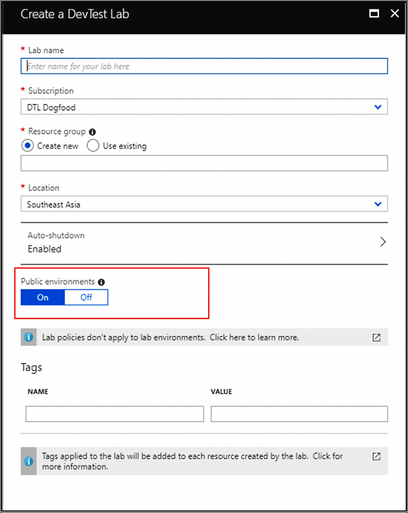


For existing labs, the public environment repository is not enabled. Manually enable it to use templates in the repository. For labs created using Resource Manager templates, the repository is disabled by default as well.

You can enable/disable public environments for your lab, and also make only specific environments available to lab users by using the following steps: 

1. Select **Configuration and policies** for your lab. 
2. In the **Virtual Machine Bases** section, select **Public environments**.
3. To enable public environments for the lab, select **Yes**. Otherwise, select **No**. 
4. If you enabled public environments, all the environments in the repository are enabled by defaults. You can de-select an environment to make it not available to your lab users. 

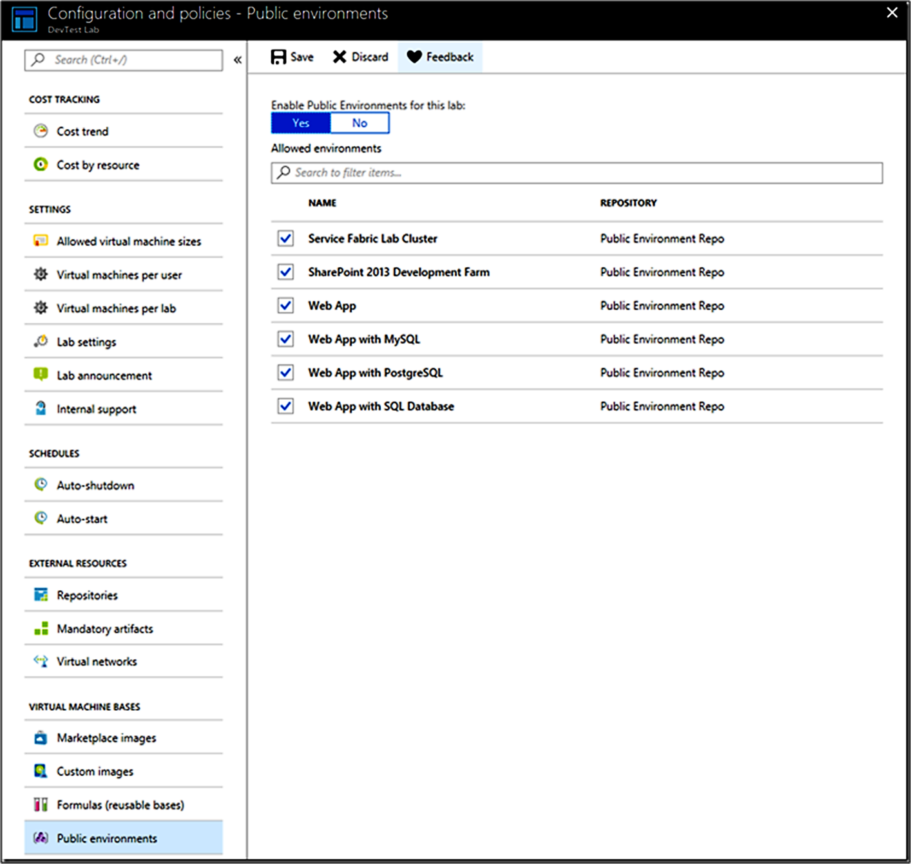

### Use environment templates as a lab user
As a lab user, you can create a new environment from the enabled list of environment templates by simply selecting **+Add** from the tool bar in the lab page. The list of bases includes the public environments templates enabled by your lab admin at the top of the list.

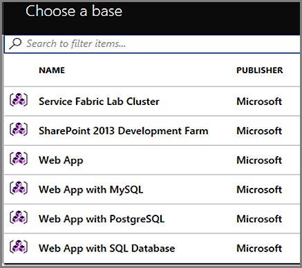


### Limit environment templates for lab users
You can reduce cost or limit the amount of templates your lab users can provision by de-selecting templates in the Public environment repository.
1. Navigate to your DevTest Lab
1. Choose '*Configuration and policies*' 
1. Choose '*Public environments*'
1. De-select templates and click 'Save'

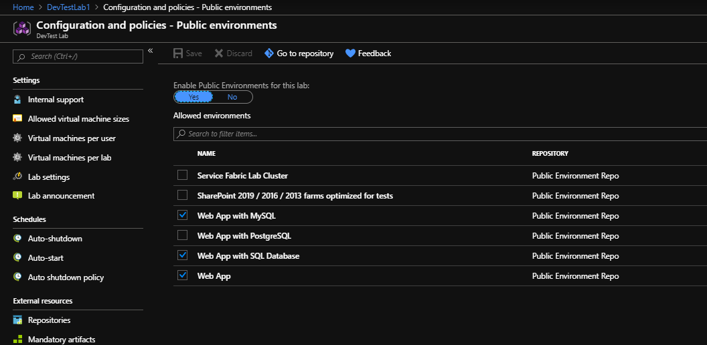

This example removes 'Service Fabric Lab Cluster, SharePoint farms optimized for tests, and Web App with PostgreSQL' as options for your lab users to provision.  To further restrict templates available to your lab users you provision a private repository.


<a name="configure-your-own-template-repositories"></a> 
## Exercise 4 - Create your own template repositories

As one of the best practices with infrastructure-as-code and configuration-as-code, you should manage environment templates in source control. Azure DevTest Labs follows this practice and loads all Azure Resource Manager templates directly from your GitHub or Azure Repos repositories. As a result, you can use Resource Manager templates across the entire release cycle, from the test environment to the production environment.

There are several rules to follow to organize your Azure Resource Manager templates in a repository:

- You must name the master template file *azuredeploy.json*. 
  
- If you want to use parameter values defined in a parameter file, the parameter file must be named *azuredeploy.parameters.json*.
  
  You can use the parameters `_artifactsLocation` and `_artifactsLocationSasToken` to construct the parametersLink URI value, allowing DevTest Labs to automatically manage nested templates. For more information, see [Deploy nested Azure Resource Manager templates for testing environments](deploy-nested-template-environments.md).
  
- You can define metadata to specify the template display name and description in a file named *metadata.json*, as follows:
  
  ```json
  { 
    "itemDisplayName": "<your template name>", 
    "description": "<description of the template>" 
  }
  ```
#### Using a GitHub repository with multiple templates.


### Add template repositories to the lab

After you create and configure your repository, you can add it to your lab by using the Azure portal: 

1. Sign in to the [Azure portal](https://portal.azure.com).
1. Select **All Services**, and then select **DevTest Labs** from the list.
1. From the list of labs, select the lab you want. 
1. On the lab's **Overview** pane, select **Configuration and policies**.
   
   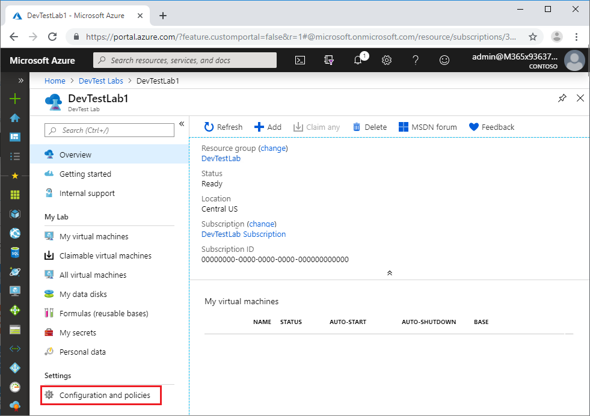
   
1. From the **Configuration and policies** settings list, select **Repositories**. The **Public Artifact Repo** repository is automatically generated for all labs and connects to the [DevTest Labs public GitHub repository](https://github.com/Azure/azure-devtestlab).
   
1. To add your Azure Resource Manager template repository, select **Add**.
   
   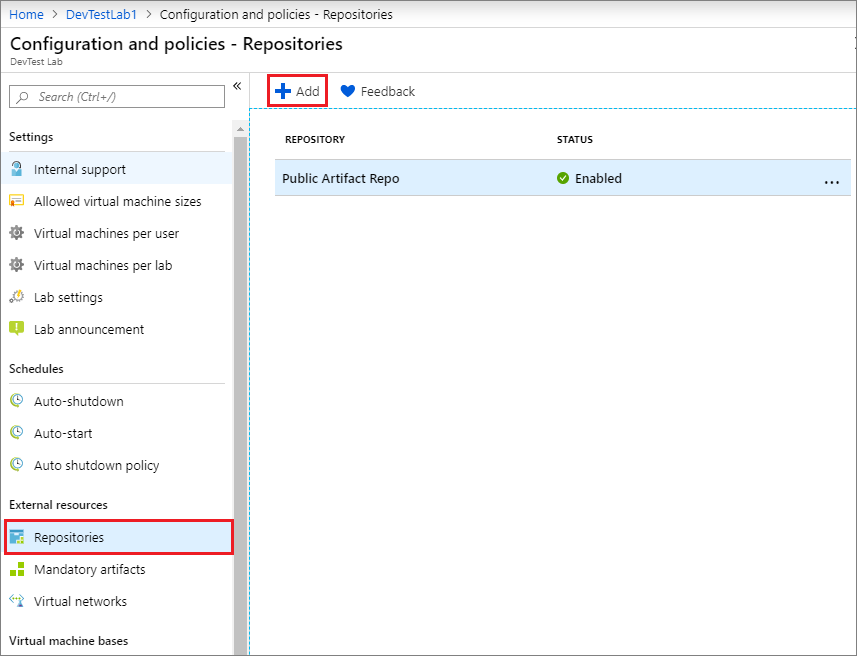
   
1. In the **Repositories** pane, enter the following information:
   
   - **Name**: Enter a repository name to use in the lab.
   - **Git clone URL**: Enter the Git HTTPS clone URL from GitHub or Azure Repos. 
   - **Branch** (optional): Enter the branch name to access your Azure Resource Manager template definitions.
   - **Personal access token**: Enter the personal access token that is used to securely access your repository.
     - To get your token from Azure Repos, under your profile, select **User settings** > **Security** > **Personal access tokens**.
     - To get your token from GitHub, under your profile, select **Settings** > **Developer Settings** > **Personal access tokens**.
   - **Folder paths**: Enter the folder path that is relative to your Git clone URI for either your artifact definitions or your Azure Resource Manager template definitions. 
   
1. Select **Save**.
   
   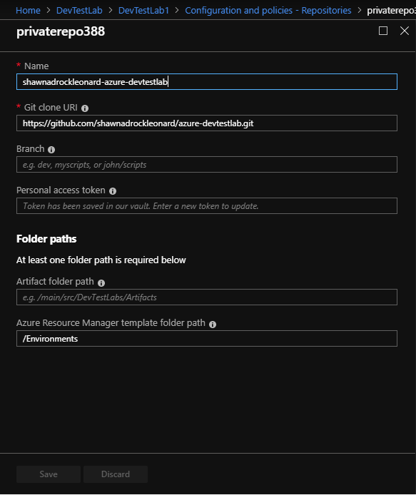

Once you add an Azure Resource Manager template to the lab, your lab users can create environments by using the template. 

   
   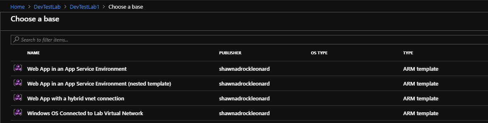


<a name="lab04-connect-virtual-network"></a> 
## Exercise 5 - Connect an environment to your lab's virtual network in Azure DevTest Labs[](#lab04-connect-virtual-network)
Azure DevTest Labs makes it easy to create VMs in a lab with [built-in networking](https://docs.microsoft.com/en-us/azure/lab-services/devtest-lab-configure-vnet). It has a great deal of flexibility with the ability to [create multi-VM environments](https://docs.microsoft.com/en-us/azure/lab-services/devtest-lab-test-env). This article shows you how to connect VMs in an environment to the lab virtual network. One scenario where you use this feature is setting up an N-tier app with a SQL Server data tier that is connected to the lab VNet allowing test VMs in the lab to access it.  


<a name="lab05-deploy-nested-templates"></a> 
## Exercise 6 - Configure test environments with nested templates

A nested deployment allows you to execute other Azure Resource Manager templates from within a main Resource Manager template. It enables you to decompose your deployment into a set of targeted and purpose-specific templates. It provides benefits in terms of testing, reuse, and readability. The article [Using linked templates when deploying Azure resources](../azure-resource-manager/resource-group-linked-templates.md) provides a good overview of this solution with several code samples. This article provides an example that's specific to Azure DevTest Labs. 

### Key parameters
The **_artifactsLocation** and **_artifactsLocationSasToken** are the key parameters that the DevTest Labs uses. 
Your templates are stored in the repository linked to the lab in DevTest Labs. When you create a new environment with those templates, the files are moved into an Azure Storage container in the lab. To be able to identify and copy the nested files, DevTest Labs identifies the _artifactsLocation and _artifactsLocationSasToken parameters and copies the subfolders up to the storage container. Then, it automatically inserts the location and Shared Access Signature (SaS) token into parameters. 

### Nested deployment sample template
Here is a simple example of a nested deployment:

```json

"$schema": "https://schema.management.azure.com/schemas/2015-01-01/deploymentTemplate.json#",
"contentVersion": "1.0.0.0",
"parameters": {
    "_artifactsLocation": {
        "type": "string"
    },
    "_artifactsLocationSasToken": {
        "type": "securestring"
    }},
"variables": {
    "NestOneTemplateFolder": "nestedtemplates",
    "NestOneTemplateFileName": "NestOne.json",
    "NestOneTemplateParametersFileName": "NestOne.parameters.json"},
    "resources": [
    {
        "name": "NestOne",
        "type": "Microsoft.Resources/deployments",
        "apiVersion": "2016-09-01",
        "dependsOn": [ ],
        "properties": {
            "mode": "Incremental",
            "templateLink": {
                "uri": "[concat(parameters('_artifactsLocation'), '/', variables('NestOneTemplateFolder'), '/', variables('NestOneTemplateFileName'), parameters('_artifactsLocationSasToken'))]",
                "contentVersion": "1.0.0.0"
            },
            "parametersLink": {
                "uri": "[concat(parameters('_artifactsLocation'), '/', variables('NestOneTemplateFolder'), '/', variables('NestOneTemplateParametersFileName'), parameters('_artifactsLocationSasToken'))]",
                "contentVersion": "1.0.0.0"
            }
        }    
    }],
"outputs": {}
```

The folder in the repository containing this template has a subfolder `nestedtemplates` with the files **NestOne.json** and **NestOne.parameters.json**. In the **azuredeploy.json**, URI for the template is built using the artifacts location, nested template folder, nested template file name. Similarly, URI for the parameters is built using the artifacts location, nested template folder, and parameter file for the nested template. 

Here is the image of the same project structure in Visual Studio: 


You can add additional folders in the primary folder but not any deeper than a single level. 

### Nested deployment example
After you create and configure your repository, you can add it to your lab by using the Azure portal: 

1. Sign in to the [Azure portal](https://portal.azure.com).
1. Select **All Services**, and then select **DevTest Labs** from the list.
1. From the list of labs, select the lab you want. 
1. On the **DevTest Lab** page for your lab, select **+ Add** on the toolbar. 

    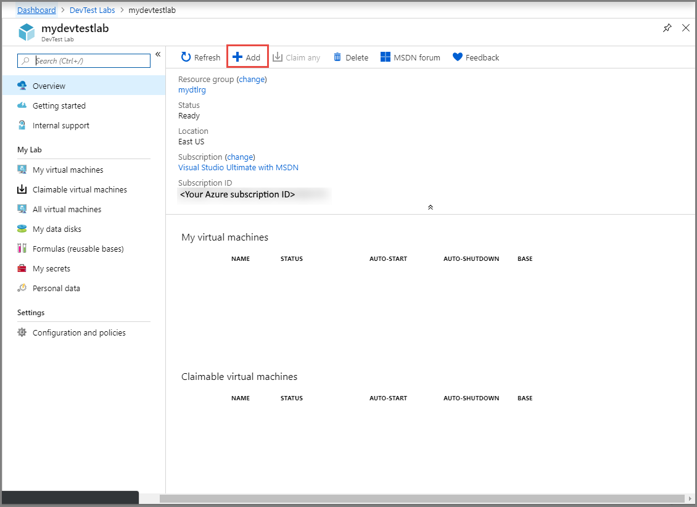
3. On the **Choose a base** page, select **Web App in an App Service Environment (nested template)** in the list. 
4. On the **Configure settings** page, do the following steps: 
    1. Specify a **name** for your cluster **environment**. This is the name of the resource group in Azure in which the ASE is going to be created. 
    2. Specify the **VNET Segment Prefix** for the virtual network address space. The default value is: **172.10**.
    3. Specify a name for the **aseName** for the App Service. 
    4. Specify an **appServicePlanName** for the App Service Plan Name. 
    4. Specify a **webAppName** for the Web site name. 
    4. Select **alwaysOn** true (website is always on) or false (website is inactive after no usage)
    7. Select **environment** for the size of the App Service Environment.
    8. Select **Add** on the **Configure Settings** page. 

    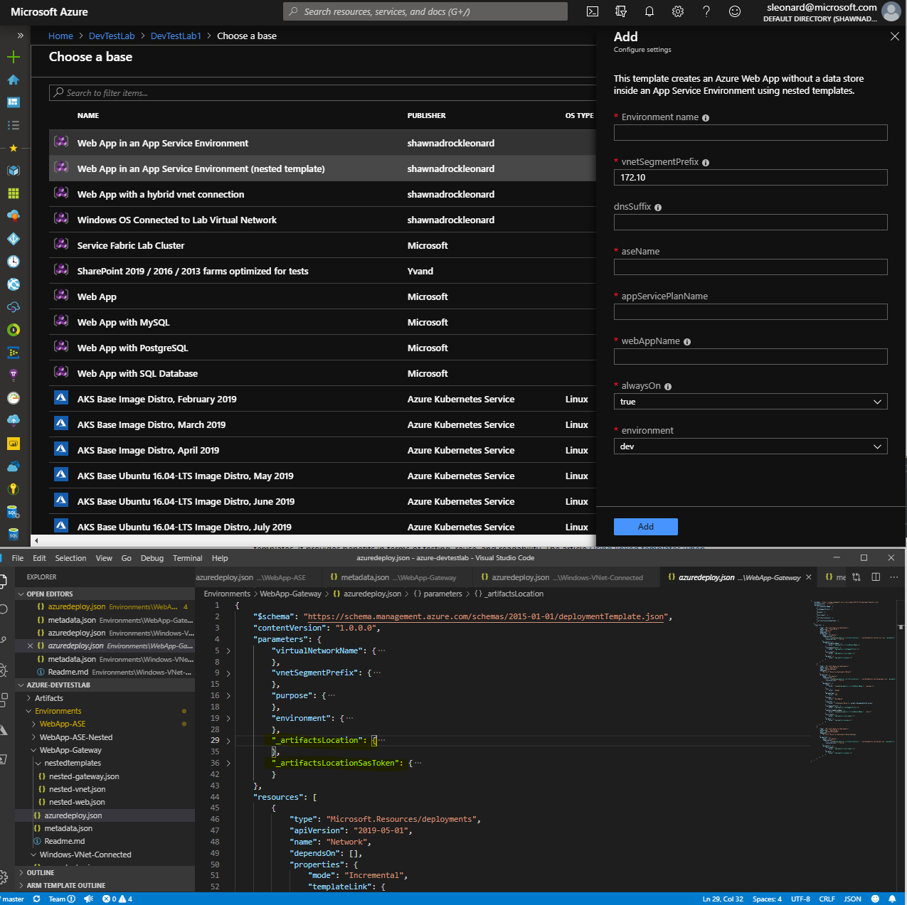

    