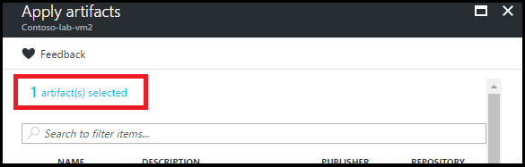

# Welcome to DevTest Labs - Managing Artifacts

## Conditions and Terms of Use Microsoft Confidential - For Internal Use Only

This training package is proprietary and confidential, and is intended only for uses described in the training materials. Content and software is provided to you under a Non-Disclosure Agreement and cannot be distributed. Copying or disclosing all or any portion of the content and/or software included in such packages is strictly prohibited.

The contents of this package are for informational and training purposes only and are provided "as is" without warranty of any kind, whether express or implied, including but not limited to the implied warranties of merchantability, fitness for a particular purpose, and non-infringement.

Training package content, including URLs and other Internet Web site references, is subject to change without notice. Because Microsoft must respond to changing market conditions, the content should not be interpreted to be a commitment on the part of Microsoft, and Microsoft cannot guarantee the accuracy of any information presented after the date of publication. Unless otherwise noted, the companies, organizations, products, domain names, e-mail addresses, logos, people, places, and events depicted herein are fictitious, and no association with any real company, organization, product, domain name, e-mail address, logo, person, place, or event is intended or should be inferred.

**Copyright and Trademarks**

Microsoft may have patents, patent applications, trademarks, copyrights, or other intellectual property rights covering subject matter in this document. Except as expressly provided in written license agreement from Microsoft, the furnishing of this document does not give you any license to these patents, trademarks, copyrights, or other intellectual property.

Complying with all applicable copyright laws is the responsibility of the user. Without limiting the rights under copyright, no part of this document may be reproduced, stored in or introduced into a retrieval system, or transmitted in any form or by any means (electronic, mechanical, photocopying, recording, or otherwise), or for any purpose, without the express written permission of Microsoft Corporation.

For more information, see Use of Microsoft Copyrighted Content at [(http://www.microsoft.com/about/legal/permissions/)](http://www.microsoft.com/about/legal/permissions/)

Microsoft®, Internet Explorer®, and Windows® are either registered trademarks or trademarks of Microsoft Corporation in the United States and/or other countries. Other Microsoft products mentioned herein may be either registered trademarks or trademarks of Microsoft Corporation in the United States and/or other countries. All other trademarks are property of their respective owners.

© 2019 Microsoft Corporation.  All rights reserved.

# Module 4 Lab - Managing Artifacts

### In this lab using the Azure Portal you will

1.  [Add artifacts to a VM](#Add-artifacts-to-a-vm)
2.  [Create custom artifacts](#Create-custom-artifacts)
3.  [Add an artifact repository to a lab](#Add-an-artifact-repository-to-a-lab)
4.  [Specify mandatory artifacts](#Specify-mandatory-artifacts)

## Exercise 1
### Add artifacts to a VM
Azure DevTest Labs artifacts let you specify actions that are performed when the VM is provisioned, such as running Windows PowerShell scripts, running Bash commands, and installing software. Artifact parameters let you customize the artifact for your particular scenario.

1. Sign in to the Azure portal.
2. Select All Services, and then select DevTest Labs from the list.
3. From the list of labs, select the lab containing the VM with which you want to work.
4. Select My virtual machines.
5. Select the desired VM.
6. Select Manage artifacts.
7. Select Apply artifacts.
8. On the Apply artifacts pane, select the artifact you wish to add to the VM.
9. On the Add artifact pane, enter the required parameter values and any optional parameters that you need.
10. Select Add to add the artifact and return to the Apply artifacts pane.
11. Continue adding artifacts as needed for your VM.
12. Once you've added your artifacts, you can change the order in which the artifacts are run. You can also go back to view or modify an artifact.
13. When you're done adding artifacts, select Apply

### Change the order in which artifacts are run

By default, the actions of the artifacts are executed in the order in which they are added to the VM. The following steps illustrate how to change the order in which the artifacts are run.

1. At the top of the Apply artifacts pane, select the link indicating the number of artifacts that have been added to the VM.

2. On the Selected artifacts pane, drag and drop the artifacts into the desired order. If you have trouble dragging the artifact, make sure that you are dragging from the left side of the artifact.

3. Select OK when done.

 ### View or modify an artifact

 The following steps illustrate how to view or modify the parameters of an artifact:

1. At the top of the Apply artifacts pane, select the link indicating the number of artifacts that have been added to the VM.

2. On the Selected artifacts pane, select the artifact that you want to view or edit.

3. On the Add artifact pane, make any needed changes, and select OK to close the Add artifact pane.

4. Select OK to close the Selected artifacts pane

## Exercise 2
### Create custom artifacts

You can use artifacts to deploy and set up your application after you provision a VM. An artifact consists of an artifact definition file and other script files that are stored in a folder in a Git repository. Artifact definition files consist of JSON and expressions that you can use to specify what you want to install on a VM. For example, you can define the name of an artifact, a command to run, and parameters that are available when the command is run. You can refer to other script files within the artifact definition file by name.

1. Install a JSON editor. You need a JSON editor to work with artifact definition files. We recommend using Visual Studio Code, which is available for Windows, Linux, and OS X.

1. Get a [sample artifactfile.json](https://github.com/Azure/azure-devtestlab/blob/master/Artifacts/windows-7zip/Artifactfile.json) definition file. Check out the artifacts created by the DevTest Labs team in our [GitHub](https://github.com/Azure/azure-devtestlab/tree/master/Artifacts) repository. We have created a rich library of artifacts that can help you create your own artifacts. Download an artifact definition file and make changes to it to create your own artifacts.

1. Make use of IntelliSense. Use IntelliSense to see valid elements that you can use to construct an artifact definition file. You also can see the different options for values of an element. For example, when you edit the targetOsType element, IntelliSense shows you two choices, for Windows or Linux.

1. Store your artifactfile.json in your Git or Azure DevOps repo.  Your artifacts should be stored as: 
    1. A folder for each artifact
    1. Include your scripts

## Exercise 3
### Add an artifact repository to a lab

#### Get the GitHub repository clone URL and personal access token

1. Go to the home page of the GitHub repository that contains the artifact or Resource Manager template definitions.
2. Select **Clone or download**.
3. To copy the URL to the clipboard, select the **HTTPS clone URL** button. Save the URL for later use.
4. In the upper-right corner of GitHub, select the profile image, and then select **Settings**.
5. In the **Personal settings** menu on the left, select **Developer Settings**.
6. Select **Personal access tokens** on the left menu.
7. Select **Generate new token**.
8. On the **New personal access token** page, under **Token description**, enter a description. Accept the default items under **Select scopes**, and then select **Generate Token**.
9. Save the generated token. You use the token later.
10. Close GitHub.   

#### Get the Azure Repos clone URL and personal access token
1. Go to the home page of your team collection (for example, https://contoso-web-team.visualstudio.com), and then select your project.
2. On the project home page, select **Code**.
3. To view the clone URL, on the project **Code** page, select **Clone**.
4. Save the URL. You use the URL later.
5. To create a personal access token, in the user account drop-down menu, select **My profile**.
6. On the profile information page, select **Security**.
7. On the **Security** tab, select **Add**.
8. On the **Create a personal access token** page:
   1. Enter a **Description** for the token.
   2. In the **Expires In** list, select **180 days**.
   3. In the **Accounts** list, select **All accessible accounts**.
   4. Select the **All scopes** option.
   5. Select **Create Token**.
9. The new token appears in the **Personal Access Tokens** list. Select **Copy Token**, and then save the token value for later use.
10. Continue to the Connect your lab to the repository section.

#### Use Azure portal
This section provides steps to add an artifact repository to a lab in the Azure portal. 

1. Sign in to the [Azure portal](https://portal.azure.com).
2. Select **More Services**, and then select **DevTest Labs** from the list of services.
3. From the list of labs, select your lab. 
4. Select **Configuration and policies** on the left menu.
5. Select **Repositories** under **External resources** section on the left menu.
6. Select **+ Add** on the toolbar.

    
5. On the **Repositories** page, specify the following information:
   1. **Name**. Enter a name for the repository.
   2. **Git Clone URL**. Enter the Git HTTPS clone URL that you copied earlier from either GitHub or Azure DevOps Services.
   3. **Branch**. To get your definitions, enter the branch.
   4. **Personal Access Token**. Enter the personal access token that you got earlier from either GitHub or Azure DevOps Services.
   5. **Folder Paths**. Enter at least one folder path relative to the clone URL that contains your artifact or Resource Manager template definitions. When you specify a subdirectory, make sure you include the forward slash in the folder path.

        
6. Select **Save**.

## Exercise 4
### Specify mandatory artifacts

As an owner of a lab, you can specify mandatory artifacts that are applied to every machine created in the lab. Imagine a scenario where you want each machine in your lab to be connected to your corporate network. In this case, each lab user would have to add a domain join artifact during virtual machine creation to make sure their machine is connected to the corporate domain. In other words, lab users would essentially have to re-create a machine in case they forget to apply mandatory artifacts on their machine. As a lab owner, you make the domain join artifact as a mandatory artifact in your lab. This step makes sure that each machine is connected to the corporate network and saving the time and effort for your lab users.

### Add a mandatory artifact

1. On the home page of your lab, select **Configuration** and policies under SETTINGS.

2. Select **Mandatory artifacts** under EXTERNAL RESOURCES.

3. Select Edit in the Windows section or the Linux section. This example uses the Windows option.

4. Select an artifact. This example uses 7-Zip option.

5. On the Add artifact page, select Add.

6. To add another artifact, select the article, and select Add. This example adds Chrome as the second mandatory artifact.

7. On the Mandatory artifacts page, you see a message that specifies the number of artifacts selected. If you click the message, you see the artifacts that you selected. Select Save to save.

8. Repeat the steps to specify mandatory artifacts for Linux VMs.

9. To delete an artifact from the list, select ...(ellipsis) at the end of the row, and select Delete.

10. To reorder artifacts in the list, hover your mouse over the artifact, select the vertical (ellipsis) that shows up at the beginning of the row (left side), and drag the item to the new position.

11. To save mandatory artifacts in the lab, select Save.

12. Close the Configuration and policies page (select X in the upper-right corner) to get back to the home page for your lab.

### Remove a mandatory artifact

1. Select **Configuration** and policies under SETTINGS.

2. Select **Mandatory artifacts** under EXTERNAL RESOURCES.

3. Select Edit in the Windows section or the Linux section. This example uses the Windows option.

4. Select the message with the number of mandatory artifacts at the top.

5. On the Selected artifacts page, select ...(ellipsis) for the artifact to be deleted, and select Remove.

6. Select OK to close the Selected artifacts page.

7. Select Save on the Mandatory artifacts page.

8. Repeat steps for Linux images if needed.

9. Select Save to save all the changes to the lab.

### View mandatory artifacts when creating a VM

Now, as a lab user you can view the list of mandatory artifacts while creating a VM in the lab. You can't edit or delete mandatory artifacts set in the lab by your lab owner.

1. On the home page for your lab, select Overview from the menu.

2. To add a VM to the lab, select + Add.

3. Select a base image. This example uses Windows Server, version 1709.

4. Notice that you see a message for Artifacts with the number of mandatory artifacts selected.

5. Select Artifacts.

6. Confirm that you see the mandatory artifacts you specified in the lab's configuration and policies.

