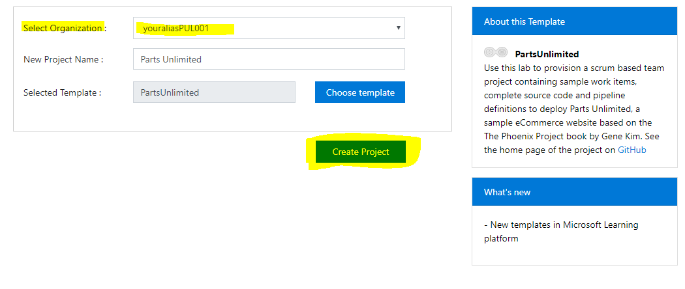
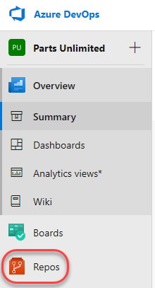

# Welcome to DevTest Labs - Integrate with CI/CD

## Conditions and Terms of Use Microsoft Confidential - For Internal Use Only

This training package is proprietary and confidential, and is intended only for uses described in the training materials. Content and software is provided to you under a Non-Disclosure Agreement and cannot be distributed. Copying or disclosing all or any portion of the content and/or software included in such packages is strictly prohibited.

The contents of this package are for informational and training purposes only and are provided "as is" without warranty of any kind, whether express or implied, including but not limited to the implied warranties of merchantability, fitness for a particular purpose, and non-infringement.

Training package content, including URLs and other Internet Web site references, is subject to change without notice. Because Microsoft must respond to changing market conditions, the content should not be interpreted to be a commitment on the part of Microsoft, and Microsoft cannot guarantee the accuracy of any information presented after the date of publication. Unless otherwise noted, the companies, organizations, products, domain names, e-mail addresses, logos, people, places, and events depicted herein are fictitious, and no association with any real company, organization, product, domain name, e-mail address, logo, person, place, or event is intended or should be inferred.

**Copyright and Trademarks**

Microsoft may have patents, patent applications, trademarks, copyrights, or other intellectual property rights covering subject matter in this document. Except as expressly provided in written license agreement from Microsoft, the furnishing of this document does not give you any license to these patents, trademarks, copyrights, or other intellectual property.

Complying with all applicable copyright laws is the responsibility of the user. Without limiting the rights under copyright, no part of this document may be reproduced, stored in or introduced into a retrieval system, or transmitted in any form or by any means (electronic, mechanical, photocopying, recording, or otherwise), or for any purpose, without the express written permission of Microsoft Corporation.

For more information, see Use of Microsoft Copyrighted Content at [(http://www.microsoft.com/about/legal/permissions/)](http://www.microsoft.com/about/legal/permissions/)

Microsoft®, Internet Explorer®, and Windows® are either registered trademarks or trademarks of Microsoft Corporation in the United States and/or other countries. Other Microsoft products mentioned herein may be either registered trademarks or trademarks of Microsoft Corporation in the United States and/or other countries. All other trademarks are property of their respective owners.

© 2019 Microsoft Corporation.  All rights reserved.

# Module 5 Lab - Integrate with CI/CD

## In this lab

1. [Excercise 1: Creating Azure DevOps organization and repository](#Ex0Task1)
1. [Excercise 2: Configuring the Parts Unlimited team project](#Ex0Task2)
1. [Excercise 3: Configuring the Parts Unlimited solution in Visual Studio](#Ex0Task3)
1. [Excercise 4: Queuing a Build](#Ex0Task4)
1. [Excercise 5: Configuring the Release pipeline for Azure services](#Ex0Task5)

## Overview

Certain Azure DevOps labs require a preconfigured **Parts Unlimited** team project. This document outlines the required steps to set up the required data.

## Excercise 1
### Creating Azure DevOps organization and repository

1. Navigate to [https://dev.azure.com](https://dev.azure.com).  Make sure you sign in with your account that is associated with an MSDN license*.  

    

1. Click 'New organization' to generate a new Repository into which we will deploy the Parts Unlimited team project.  Accept the terms and click '*Continue*'

    

1. Choose an organization name.  It should be prefixed with your login alias.  Then click '*Continue*'

    

1. Choose a project name.  You can leave the default Visibility in place or switch to 'Private'.  Then create the project.

    

1. Navigate to [ms-azuredevtestlabs.tasks](https://marketplace.visualstudio.com/items?itemName=ms-azuredevtestlabs.tasks) to install the DevTest Labs Tasks extension

    

1. Choose the new '*Organization*' and then click Install

    

-* If you have a PASS account go ahead and log in with that account.

## Excercise 2
### Configuring the Parts Unlimited team project

1. Navigate to [https://azuredevopsdemogenerator.azurewebsites.net](https://azuredevopsdemogenerator.azurewebsites.net/). This utility site will automate the process of creating a new Azure DevOps project within your account that is prepopulated with content (work items, repos, etc.) required for the lab. For more information on the site, please see [https://docs.microsoft.com/en-us/azure/devops/demo-gen](https://docs.microsoft.com/en-us/azure/devops/demo-gen).

1. Sign in using the Microsoft account associated with your Azure DevOps subscription.

    

1. **Accept** the permission requests for accessing your subscription.

1. Select your Azure DevOps organization and enter the project name **"Parts Unlimited"**. Click **Choose Template**.

    

1. Select the **PartsUnlimited** template and click **Select Template**.

    

1. Click **Create Project** and wait for the process to complete.

    

1. You should see the in progress screens.  The expected out come is a new project repository, new boards, new work items, a default build and release definition.

    

1. Navigating to the resulting repository should appear as:

    

## Excercise 3
### Configuring the Parts Unlimited solution in Visual Studio

1. Some labs will require you to open the **Parts Unlimited** solution in **Visual Studio**. If your lab doesn't require this, you can skip this task.

1. Navigate to your Azure DevOps team project for **Parts Unlimited**. It will be something like [https://dev.azure.com/YOURACCOUNT/Parts%20Unlimited](https://dev.azure.com/YOURACCOUNT/Parts%20Unlimited).

1. Navigate to the **Repos** hub.

    

1. Click **Clone** and select **Clone in Visual Studio**.

    

1. Follow the workflow to clone and configure the project in Visual Studio. Click **Connect** to copy the repo locally.

    

1. From **Team Explorer**, double-click **PartsUnlimited.sln** from the **Solutions** section to open the solution. You can ignore warnings about unsupported project types.

    

1. Change some text in PartsUnlimitedWebsite > Views > Home > Index.cshtml file

1. Switch to the Team Explorer view > Choose '*Changes*'.  You should see the file you changed.

    

1. Enter a comment then choose '*Commit All and Sync*'

1. Leave Visual Studio open for use in your lab.

## Excercise 4
### Queuing a Build
  
The general flow of the Build pipeline is to ensure your product can build, be tested, and be deployed.

   

1. Navigate to the Builds link.

    

1. Click '*Queue*'

    

1. Leave the modal dialog defaults and click '*Run*'

    

1. After the Build is queued and complete you'll see the full status of the build along with logs.

    

1. In the Build results pane you can take a look at the '*Artifacts*' which are the result of the MSBuild commands

    

1. Alternatively the Build is configured to run anytime code is committed to the master branch.   After you've cloned the project locally, changed some code, and committed/sync'd that code a build should trigger.

## Exercise 5
### Configuring the Release pipeline for Azure services
  
The general flow of the Release pipeline is to ensure your infrastructure is as expected and the built solution runs successfully.

   

1. Open a separate browser tab

1. Sign in to the [Azure portal](https://portal.azure.com).

1. Select **All Services**, and then select **DevTest Labs** from the list.

1. From the list of labs, select the lab you want. 

1. On the lab's page, select **Add**.

1. In the Choose a Base choose '*Web App with SQL Database*'
    1. Environment name can be '*WebAppAndSQL*'
    1. Database Administrator Login '*DevTestAdmin*'
    1. Database Administrator Login Password should reuse our KeyVault secret '*VmPassword*'

    

1. Once the resources are provisioned navigate to the SQL Server Database and copy the connection string into notepad, replace {your_username} with the Database Administrator username and replace {your_password} with the password.

    

1. Navigate to the App Service and Add a '*New connection string*'.
    1. Enter '*DefaultConnectionString*' for Name
    1. Copy your connection string from notepad into Value
    1. Select '*SQLAzure*' for the Type
    1. Click '*Ok*'

    

    1. Click '*Save*' on the App Service Configuration pane.

    

1. Navigate to '*Subscriptions*' and take note of your Subscription name and ID.

    

1. You can now close this tab containing the Azure Portal.

1. Navigate to *Releases* in Azure DevOps

1. Click on 'PartsUnlimitedE2E' and click '*Edit*' in the top right.

1. You'll see multiple stages representing Dev/QA/Production.  We are going to remove QA and Production.  Click on 'QA' and choose Delete.  Repeat for the Production task.

    

1. In the Dev stage we will click on '*1 job, 2 tasks*'.  Right click on '*Azure Deployement*' and choose Disable Task

    

1. Click on 'Azure App Service' then choose the 'Azure subscription'.  Select the value from your Azure subscription you noted earlier.  Then click '*Authorize*' to create a service principal which will allow Azure DevOps to deploy into your Azure resources.

    

1. Once you have Authorized Azure DevOps with access to your Azure subscription you can choose the remaining values.
    1. In the App Service name setting choose the drop-down and find the App Service name provisioned during the DevTest Labs add steps.  In this example DevTest Labs provisioned an app service and it has been selected in the drop-down.
    1. Change the 'Deploy to slot' option to unchecked.
    1. Check the box 'Publish using Web Deploy'
    1. Leave the remaining settings.
    1. Click '*Save*'

    

1. Create a new release.
    1. Click on 'Pipeline'
    1. Click 'Create release' on the top right to launch a dialog

    

1. In the dialog leave everything filled in then click '*Create*'

    

1. You'll see a banner/notification indicating the Release-## which was just created.

    

1. Click the Release-## hyperlink and you'll see the progress of your release

    

1. You can then navigate to the website.  The App Service name with AzureWebsites.net will be the URL.  Launch the App Service URL to validate the deployment

     

1. You can launch the URL in the browser to see your provisioned website

     

Now you can make a change to your code base and commit the changes to the source repository.  Once you've commited your code to the repository a build will be initiated.  After the build is successful it will initiate a release.  The website will be updated each time this occurs.  
