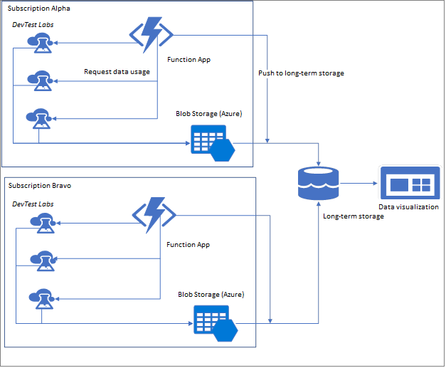
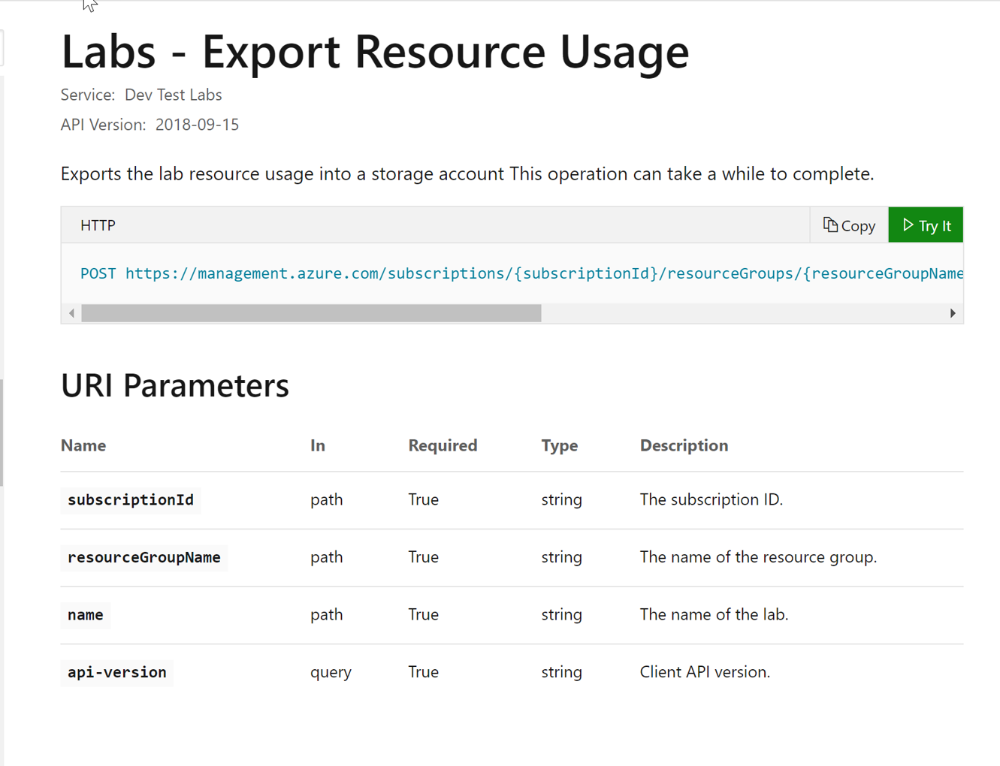
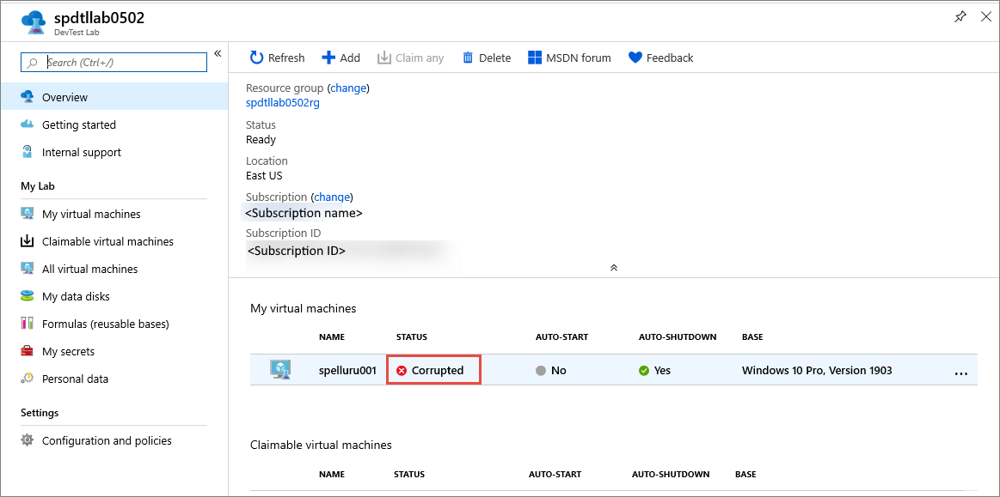
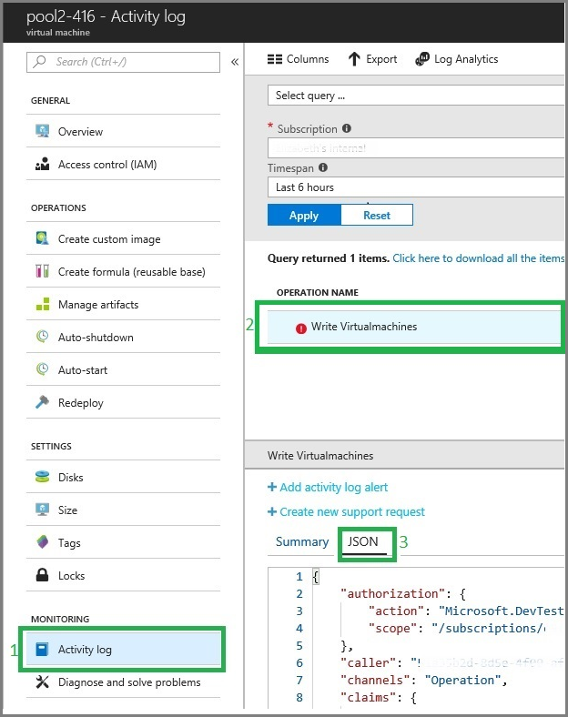
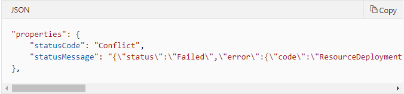
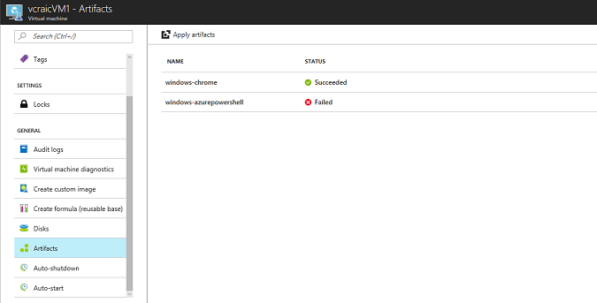
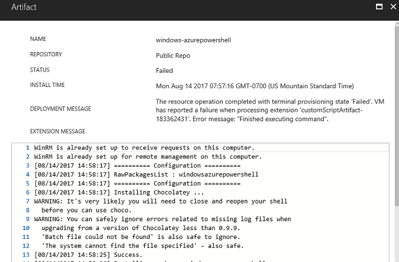
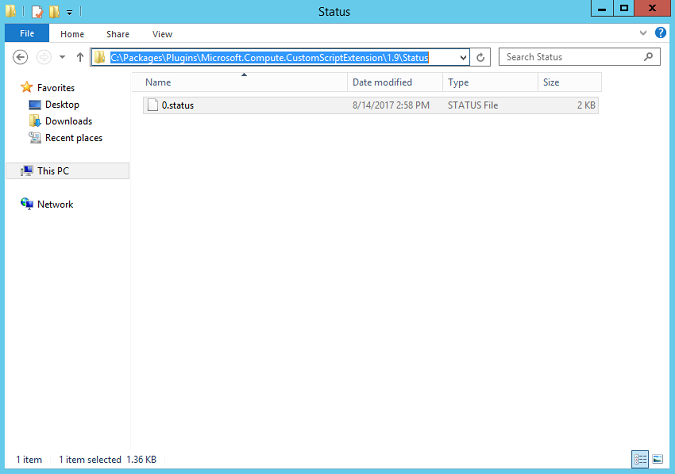

# Welcome to DevTest Labs - Troubling Shooting

## Conditions and Terms of Use Microsoft Confidential - For Internal Use Only

This training package is proprietary and confidential, and is intended only for uses described in the training materials. Content and software is provided to you under a Non-Disclosure Agreement and cannot be distributed. Copying or disclosing all or any portion of the content and/or software included in such packages is strictly prohibited.

The contents of this package are for informational and training purposes only and are provided "as is" without warranty of any kind, whether express or implied, including but not limited to the implied warranties of merchantability, fitness for a particular purpose, and non-infringement.

Training package content, including URLs and other Internet Web site references, is subject to change without notice. Because Microsoft must respond to changing market conditions, the content should not be interpreted to be a commitment on the part of Microsoft, and Microsoft cannot guarantee the accuracy of any information presented after the date of publication. Unless otherwise noted, the companies, organizations, products, domain names, e-mail addresses, logos, people, places, and events depicted herein are fictitious, and no association with any real company, organization, product, domain name, e-mail address, logo, person, place, or event is intended or should be inferred.

**Copyright and Trademarks**

Microsoft may have patents, patent applications, trademarks, copyrights, or other intellectual property rights covering subject matter in this document. Except as expressly provided in written license agreement from Microsoft, the furnishing of this document does not give you any license to these patents, trademarks, copyrights, or other intellectual property.

Complying with all applicable copyright laws is the responsibility of the user. Without limiting the rights under copyright, no part of this document may be reproduced, stored in or introduced into a retrieval system, or transmitted in any form or by any means (electronic, mechanical, photocopying, recording, or otherwise), or for any purpose, without the express written permission of Microsoft Corporation.

For more information, see Use of Microsoft Copyrighted Content at [(http://www.microsoft.com/about/legal/permissions/)](http://www.microsoft.com/about/legal/permissions/)

Microsoft®, Internet Explorer®, and Windows® are either registered trademarks or trademarks of Microsoft Corporation in the United States and/or other countries. Other Microsoft products mentioned herein may be either registered trademarks or trademarks of Microsoft Corporation in the United States and/or other countries. All other trademarks are property of their respective owners.

© 2019 Microsoft Corporation.  All rights reserved.

# Module 6 Lab - Trouble Shooting

### In this lab using the Azure Portal you will

1.  [Usage monitoring](#Usage-and-monitoring)
1.  [Look for Portal notifications](#Look-for-Portal-notifications)
2.  [Activity logs for resources](#Activity-logs-for-resources)
3.  [Diagnose artifact failures](#Diagnose-artifact-failures)

## Exercise 1
### Usage monitoring

Usage monitoring is vital to any organization.  DevTest Labs enables your organization to gain an understanding of cost, usage, trends, and best practices.  There are a number of ways to access reporting.  Most large organizations want to track resource usage to be more effective with those resources by visualizing trends and outliers in the usage.    Based on resource usage the lab owners or managers can customize the labs to improve resource usage and costs. 

In Azure DevTest Labs, you can download resource usage per lab allowing a deeper historical look into the usage patterns.  These usage patterns can help pinpoint changes to improve efficiency.  Most enterprises want both individual lab usage and overall usage across multiple labs and subscriptions.

Use a data visualization tool of your choice to connect to your long-term storage to display the usage data and gather insights to verify usage efficiency.   These interfaces are available for your organization.

1. Individual Labs
    1. Rest API
    1. Powershell

1. All Labs
    1. Azure Functions
    1. Automation Runbook

You can export resource usage into a Storage Account.  You can then connect Power BI to the logs in the storage account.  

## Exercise 2
### Look for Portal notifications
If you're using the Azure portal, the first place to look at is the notifications panel. The notifications panel, available on the main command bar by clicking the bell icon, will tell you whether the lab VM or environment creation was successful or not. If there was a failure, you see the error message associated with the creation failure. The details often give further information to help you resolve the issue. In the following example, the virtual machine creation failed because of running out of cores. The detailed message tells you how to fix the issue and request a core quota increase

### VM in corruption state
If you see the status of your VM in the lab as Corrupted, the underlying VM may have been deleted from the Virtual Machine page that user can navigate to from the Virtual Machines page (not from the DevTest Labs page). Clean up your lab in DevTest Labs by deleting the VM from the lab. Then, recreate your VM in the lab.

## Exercise 3
### Activity logs for resources

You can use DevTest labs to easily deploy, configure, and set up your application after you provision a resource.   In some cases there may be an intermittent failure in the virtual machine, your custom artifact is incorrectly coded, or an configuration conflicts with another.  It is important to review logs to ensure your development, labs, and eventual production code work as expected.  

1. On the home page for your lab, select the VM to launch the Virtual Machine page.

1. On the Virtual Machine page, in the MONITORING section of the left menu, select Activity log to see all logs associated with the VM.

1. In the activity log items, select the operation that failed (your lab may not have any). Typically, the failed operation is called Write Virtualmachines.

1. In the right pane, switch to the JSON tab. You see the details in the JSON view of the log.

1. Look through the JSON log until you find the statusMessage property. It gives you the main error message and further detail information, if applicable. The following JSON is an example for the core quoted exceeded error.

## Exercise 4
### Diagnose artifact failures

After you have created an artifact, you can check to see whether it succeeded or failed. Artifact logs in Azure DevTest Labs provide information that you can use to diagnose an artifact failure. You have a couple of options for viewing the artifact log information for a Windows VM:
- In the Azure portal
- In the VM

### Troubleshoot artifact failures by using the Azure portal

1. In the Azure portal, in your list of resources, select your lab.

2. Choose the Windows VM that includes the artifact that you want to investigate.

3. In the left panel, under GENERAL, select Artifacts. A list of artifacts associated with that VM appears. The name of the artifact and the artifact status are indicated.

4. Select an artifact that shows a Failed status (your lab may not have any currently). The artifact opens. An extension message that includes details about the failure of the artifact is displayed.

### Troubleshoot artifact failures from within the virtual machine

1. Sign in to the VM that contains the artifact you want to diagnose.

2. Go to C:\Packages\Plugins\Microsoft.Compute.CustomScriptExtension\1.9\Status, where 1.9 is the Azure Custom Script Extension version number.

3. Open the status file.